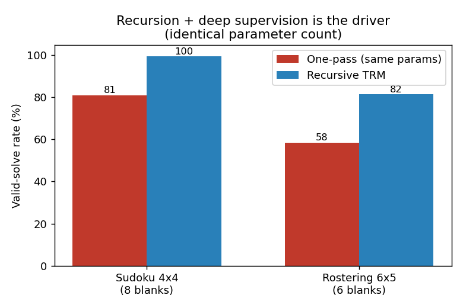
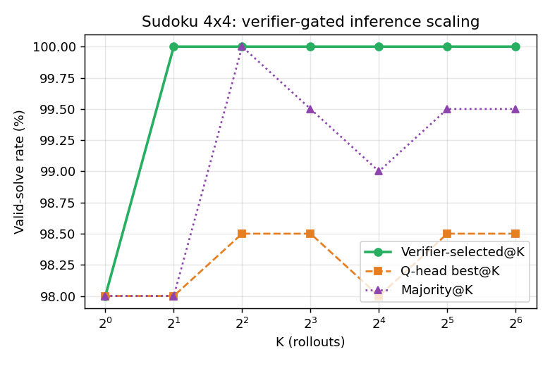
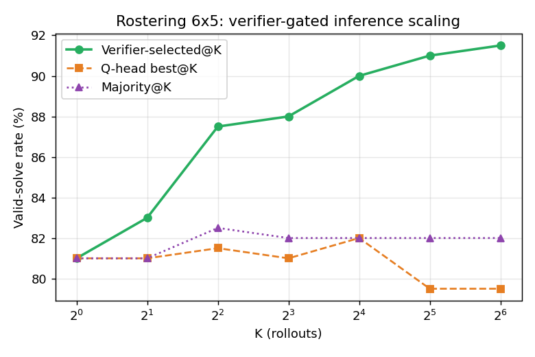
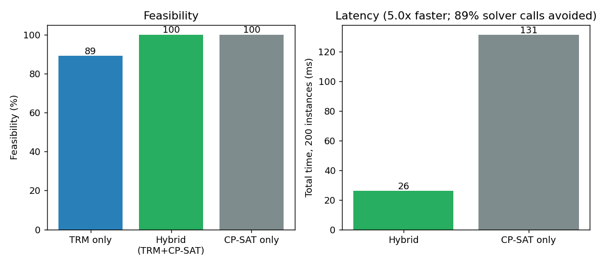

# Tiny Recursive Reasoning Models: Evidence Synthesis, Extensions, and Industrial Applicability of TRM, HRM and Their Successors

## Abstract

This paper synthesises the evidence on tiny recursive reasoning models: the Hierarchical Reasoning Model (HRM), the Tiny Recursive Model (TRM) and their 2025–2026 extensions. It assesses whether their strength on multi-step constraint reasoning transfers to industrial problems. It also proposes an evaluation protocol for doing so.

> **Evidentiary status (read first).** No new experiment in this work produced a meaningful accuracy result. The only completed run was a CPU smoke test on 4×4 Sudoku with a 9.3K-parameter TRM-style network. It was severely under-trained, returned 0.0% fully valid grids for every method, and is reported in Section 8 as a failed, underpowered reproduction attempt. **Every accuracy figure elsewhere in this paper is literature-reported.** Core TRM/HRM figures come from the primary arXiv paper and ARC Prize verification. Figures for the 2026 extensions come from machine-extracted summaries of arXiv HTML pages, not table-verified PDFs, and are labelled "as reported". The industrial protocol in Section 10 is a proposal; none of it has been run.

**Key findings:**

- **TRM is a narrow, per-task-trained solver.** It is a single 2-layer network of about 7M parameters. It reports 44.6% on ARC-AGI-1 and 7.8% on ARC-AGI-2 (pass@2, public evaluation sets), against 40.3% and 5.0% for the 27M-parameter HRM [[1]](https://arxiv.org/pdf/2510.04871) [[2]](https://arxiv.org/abs/2510.04871). ARC Prize's independent runs gave 40% (\$1.76/task) and 6.2% (\$2.10/task) for TRM [[29]](https://x.com/arcprize/status/1978872651180577060?lang=en). For HRM they gave 32% and 2% on the semi-private set [[20]](https://arcprize.org/blog/hrm-analysis).
- **The gains come from iterative refinement, not hierarchy.** ARC Prize ablations found that a same-sized transformer came within roughly 5 percentage points of HRM [[20]](https://arcprize.org/blog/hrm-analysis). TRM's own ablations show that full backpropagation through the recursion, weight averaging and a single network drive its improvement [[1]](https://arxiv.org/pdf/2510.04871).
- **Inference-time scaling on tiny recursive models is cheap but verifier-dependent.** Probabilistic TRM (PTRM) lifts Sudoku-Extreme from 87.28% to 98.75% with no retraining, at about \$0.001 per attempt [[60]](https://arxiv.org/html/2605.19943v1). The same method gains nothing on Maze-Hard when the model's internal ranking head cannot identify the correct rollouts [[60]](https://arxiv.org/html/2605.19943v1) [[61]](https://arxiv.org/html/2605.25230v2).
- **Sound abstention is the property industry needs most.** Lattice Deduction Transformers (LDT) return a correct answer or abstain. They reach 100% soundness on Sudoku-Extreme with 800K parameters, and fail on ARC-style rule induction [[62]](https://arxiv.org/html/2605.08605v1).
- **No primary-source industrial deployment or ROI case study for TRM or HRM was found.** Sapient Intelligence's healthcare, climate and robotics claims are company statements [[31]](https://www.barchart.com/story/news/33531455/sapient-intelligence-opensources-hierarchical-reasoning-model-a-braininspired-architecture-that-solves-complex-reasoning-tasks-with-27-million-parameters) [[44]](https://www.prnewswire.com/news-releases/sapient-intelligence-launches-hrm-text-challenging-the-llm-monopoly-with-a-brain-inspired-foundation-model-trained-on-up-to-1000x-fewer-tokens-302774638.html). No benchmark of sub-1B language models on scheduling, routing or constraint satisfaction was located either.

---

## 1. Introduction — Why small recursive models matter for industry, and what can honestly be claimed

Recursive tiny networks achieve their headline results by spending computation on iteration rather than parameters. **TRM reaches 44.6% on ARC-AGI-1 with about 7M parameters, which is 0.00104% of the 671B parameters of DeepSeek R1** (computed from the paper's parameter figures; the paper itself states "less than 0.01%") [[1]](https://arxiv.org/pdf/2510.04871).

That efficiency profile is attractive for industrial settings with strict latency, cost, privacy or edge constraints. Many enterprise problems share the structure of the benchmarks these models solve: fixed-size encodings, hard constraints and checkable outputs. Examples are shift scheduling, timetabling, slotting and constraint validation.

The research questions are:

1. **RQ1.** What are TRM and HRM, and which design elements demonstrably drive their accuracy?
2. **RQ2.** What accuracy do independent evaluations and the 2025–2026 extensions report, and how comparable are those numbers?
3. **RQ3.** How do these models sit relative to large reasoning LLMs and to small language models (SLMs)?
4. **RQ4.** Which industrial problems fit, how should they be piloted, and what evidence is missing?

The user asked for accuracy evaluations on any new methodology. Section 8 states plainly what was and was not achieved. Section 10 gives the protocol a team would need to run to close the gap.

---

## 2. Background — HRM and TRM architectures

TRM replaces HRM's two-network, biologically motivated hierarchy with one small network recursed on two latent states. This gives a simpler design, fewer parameters and higher accuracy on the benchmarks reported.

### 2.1 Hierarchical Reasoning Model (HRM)

HRM (Wang et al., Sapient Intelligence/Tsinghua, arXiv:2506.21734, 26 June 2025) has 27M parameters and was trained from scratch on about 1,000 examples without pretraining or chain-of-thought. It uses two coupled recurrent modules: a high-level module for slow planning and a low-level module for fast computation [[34]](https://sapient.inc/pdf/hrm-paper.pdf) [[5]](https://arxiv.org/html/2506.21734v1). In the TRM paper's description, HRM has four learnable components (input embedding, low-level fL, high-level fH and output head). Each network is a 4-layer Transformer with RMSNorm, no bias, rotary embeddings and SwiGLU, and HRM uses n=2, T=2 [[1]](https://arxiv.org/pdf/2510.04871). Sapient open-sourced HRM on 21 July 2025 [[31]](https://www.barchart.com/story/news/33531455/sapient-intelligence-opensources-hierarchical-reasoning-model-a-braininspired-architecture-that-solves-complex-reasoning-tasks-with-27-million-parameters). Its "100x faster reasoning" claim is a company estimate, and media coverage noted the absence of independent verification and of a trained checkpoint in the initial release [[43]](https://offthegridxp.substack.com/p/what-is-sapient-intelligence-hierarchical-reasoning-model-hrm) [[33]](https://www.poniaktimes.com/sapient-hierarchical-reasoning-model/).

### 2.2 Tiny Recursive Model (TRM)

TRM ("Less is More: Recursive Reasoning with Tiny Networks", Alexia Jolicoeur-Martineau, Samsung SAIL Montreal, arXiv:2510.04871, submitted 6 October 2025) uses a single 2-layer network [[1]](https://arxiv.org/pdf/2510.04871) [[2]](https://arxiv.org/abs/2510.04871). Its mechanics, as reported [[1]](https://arxiv.org/pdf/2510.04871):

- **State.** Two latent features are retained: y (the current answer) and z (latent reasoning).
- **Latent recursion.** z ← net(x, y, z) is repeated n times, then y ← net(y, z).
- **Deep recursion.** T−1 recursions run without gradient, then one runs with gradient.
- **Supervision.** Deep supervision runs for at most Nsup = 16 steps.
- **Final hyperparameters.** n=6 and T=3 give 42 effective recursions per supervision step.
- **Gradients.** The fixed-point/one-step gradient approximation is removed. The full n+1 recursion is backpropagated.
- **Halting.** The adaptive computation time (ACT) "continue" loss, which required a second forward pass, is dropped. Only a halting binary cross-entropy loss remains.
- **Training details.** Weights are averaged with an exponential moving average (EMA, decay 0.999). Hidden size is 512, batch size 768, with AdamW (β1=0.9, β2=0.95), 2K-iteration warmup and stable-max loss.
- **Attention versus MLP.** TRM-MLP replaces self-attention with an MLP over the sequence dimension. It is strong on the small fixed 9×9 Sudoku grids and suboptimal on 30×30 tasks (Maze-Hard, ARC).

The official repository (SamsungSAILMontreal/TinyRecursiveModels, MIT licence) was archived read-only on 1 April 2026 and has about 6.6k stars [[3]](https://github.com/SamsungSAILMontreal/TinyRecursiveModels). Its README reproduction configurations use arch=trm with L_layers=2, H_cycles=3 and L_cycles=6 for Sudoku (the repository's cycle names map to the paper's T and n). Maze-Hard and ARC-AGI use L_cycles=4, and all configurations enable EMA. ARC training takes about 3 days on 4 H100 GPUs [[3]](https://github.com/SamsungSAILMontreal/TinyRecursiveModels).

### 2.3 Training and evaluation setup in the TRM paper

| Item | Setting [[1]](https://arxiv.org/pdf/2510.04871) |
|---|---|
| Sudoku-Extreme | 9×9; 1K training samples; 423K test samples; 1000 shuffle augmentations |
| Maze-Hard | 30×30; shortest path >110; 1000 train / 1000 test mazes; 8 dihedral augmentations |
| ARC-AGI-1 / ARC-AGI-2 | 800 tasks / 1120 tasks, each augmented with 160 ConceptARC tasks; public evaluation sets; 1000 augmentations per example; two attempts (pass@2) |
| Sudoku/Maze training | 60k epochs, lr 1e-4, weight decay 1.0 |
| ARC training | 100K epochs, lr 1e-4 (1e-2 for embeddings), weight decay 0.1 |
| Compute | Sudoku: 1 L40S (<36 h); Maze: 4 L40S (<24 h); ARC: 4 H100 (~3 days) |

> **Methodological note.** The LLM baselines (DeepSeek R1, Claude 3.7, o3-mini-high), direct prediction and HRM in the TRM tables are copied from the HRM paper (Wang et al., 2025) and were not re-run by the TRM authors [[1]](https://arxiv.org/pdf/2510.04871). All ARC numbers in the paper are public-evaluation-set numbers, not semi-private leaderboard numbers [[1]](https://arxiv.org/pdf/2510.04871).

This section established the mechanics. The next reports what those mechanics achieved and how independent verification qualifies it.

---

## 3. Results as Reported — Benchmark accuracy and independent verification

TRM improves on HRM on every reported benchmark, but ARC-AGI-2 remains hard for tiny models, and independent verification lowers both models' scores.

### 3.1 Sudoku-Extreme and Maze-Hard (TRM paper, Table 4, % test accuracy)

| Model (params) | Sudoku-Extreme | Maze-Hard |
|---|---|---|
| DeepSeek R1 (671B) | 0.0 | 0.0 |
| Claude 3.7 8K | 0.0 | 0.0 |
| o3-mini-high | 0.0 | 0.0 |
| Direct prediction (27M) | 0.0 | 0.0 |
| HRM (27M) | 55.0 | 74.5 |
| TRM-Att (7M) | 74.7 | 85.3 |
| TRM-MLP (5M Sudoku / 19M Maze label) | 87.4 | 0.0 (as extracted) |

Source: [[1]](https://arxiv.org/pdf/2510.04871). The TRM-MLP Maze entry of 0.0 is consistent with the paper's text that the MLP variant is poor on Maze-Hard, and a Mamba-2 hybrid study also lists 0.0% for MLP variants on Maze [[66]](https://arxiv.org/html/2602.12078v2). The TRM-MLP parameter label is ambiguous in the extracted text (5M versus a 15M footnote on Sudoku, and 19M on Maze). A parameter count for the MLP variant should be confirmed against the PDF before it is quoted [[1]](https://arxiv.org/pdf/2510.04871) [[35]](https://ar5iv.labs.arxiv.org/html/2510.04871).

Two points qualify the headline "55%→87%" Sudoku improvement. First, 87.4% is the MLP variant, not the 7M attention model, whose Sudoku result is 74.7% [[1]](https://arxiv.org/pdf/2510.04871). Second, using the same arithmetic as the paper's numbers, TRM-MLP exceeds HRM by **32.4 percentage points** on Sudoku-Extreme, and TRM-Att exceeds HRM by **10.8 points** on Maze-Hard.

### 3.2 ARC-AGI (TRM paper, Table 5, % test accuracy, 2 tries, public evaluation sets)

| Model (params) | ARC-AGI-1 | ARC-AGI-2 |
|---|---|---|
| Deepseek R1 (671B) | 15.8 | 1.3 |
| Claude 3.7 16K | 28.6 | 0.7 |
| o3-mini-high | 34.5 | 3.0 |
| Gemini 2.5 Pro 32K | 37.0 | 4.9 |
| Grok-4-thinking (1.7T) | 66.7 | 16.0 |
| Bespoke (Grok-4) (1.7T) | 79.6 | 29.4 |
| Direct prediction (27M) | 21.0 | 0.0 |
| HRM (27M) | 40.3 | 5.0 |
| TRM-Att (7M) | 44.6 | 7.8 |
| TRM-MLP (19M) | 29.6 | 2.4 |

Source: [[1]](https://arxiv.org/pdf/2510.04871). On ARC-AGI-1 and ARC-AGI-2, TRM-Att improves on HRM by 4.3 and 2.8 percentage points respectively (paper figures, pass@2, public evaluation). The Grok-4 rows show that **TRM does not beat frontier LLMs on ARC-AGI-2**: Grok-4-thinking scores 16.0% and the Bespoke Grok-4 system 29.4%, against TRM's 7.8%. The "beats DeepSeek R1, o3-mini and Gemini 2.5 Pro" framing holds only against the three older models listed [[1]](https://arxiv.org/pdf/2510.04871).

### 3.3 Claimed versus independently verified scores

ARC Prize re-ran HRM on the hidden semi-private tasks (ARC Prize blog, 15 August 2025). It reported 32% on ARC-AGI-1 (100 tasks, 9h 16m, total cost \$148.50, or \$1.48/task) and 2% on ARC-AGI-2 (120 tasks, 12h 35m, \$201, or \$1.68/task). The ARC-AGI-2 run exceeded the 12-hour limit but was still considered valid. ARC Prize said it does not regard 2% as meaningful progress. It described the 32% as roughly 9 points below HRM's claimed 41% public-evaluation score and as "not overfit" [[20]](https://arcprize.org/blog/hrm-analysis) [[22]](https://x.com/arcprize/status/1956431617951740044). ARC Prize reported verified TRM results of 40% (\$1.76/task) on ARC-AGI-1 and 6.2% (\$2.10/task) on ARC-AGI-2 [[29]](https://x.com/arcprize/status/1978872651180577060?lang=en).

| Model | ARC-AGI-1 paper (public, pass@2) | ARC-AGI-1 verified (semi-private) | Gap | ARC-AGI-2 paper | ARC-AGI-2 verified | Gap |
|---|---|---|---|---|---|---|
| HRM (27M) | 40.3 (ARC Prize quotes 41) | 32 | −9 pp (from the 41 figure) | 5.0 | 2 | −3.0 pp |
| TRM-Att (7M) | 44.6 | 40 | −4.6 pp | 7.8 | 6.2 | −1.6 pp |

Sources: [[2]](https://arxiv.org/abs/2510.04871) [[20]](https://arcprize.org/blog/hrm-analysis) [[22]](https://x.com/arcprize/status/1956431617951740044) [[29]](https://x.com/arcprize/status/1978872651180577060?lang=en); gaps computed from these figures.

As the chart shows, public-to-semi-private degradation is real for both models and smaller for TRM. On the semi-private set TRM's ARC-AGI-1 score (40%) is 25.0% higher in relative terms than HRM's (32%). Cost per task is slightly higher for TRM (\$1.76 versus \$1.48 on ARC-AGI-1, and \$2.10 versus \$1.68 on ARC-AGI-2).

An independent analysis (arXiv:2512.11847) used the ARC Prize verification checkpoint. It finds that paper-mode inference (1000 augmentations plus voting) gives 40.00% Pass@1 on ARC-AGI-1, against 29.25% for a single augmentation without voting, a difference of 10.75 points. Accuracy collapses when puzzle identity is blanked or randomised [[19]](https://arxiv.org/abs/2512.11847) [[28]](https://arxiv.org/pdf/2512.11847). A second independent number (a different metric) appears in the Universal Reasoning Model paper, which reproduced TRM at 40.0% pass@1 [[64]](https://arxiv.org/html/2512.14693v3). These reproductions are not contradictions. They measure different protocols, and every quoted ARC figure must name its metric and verifier.

### 3.4 What TRM's own ablations show (Sudoku-Extreme)

| Configuration | Test acc. (%) | Effective depth | Forward passes | Params |
|---|---|---|---|---|
| HRM | 55.0 | 24 | 2 | 27M |
| TRM (T=3, n=6) | 87.4 | 42 | 1 | 5M |
| w/ ACT (continue loss) | 86.1 | 42 | 2 | 5M |
| w/ separate fH, fL | 82.4 | 42 | 1 | 10M |
| no EMA | 79.9 | 42 | 1 | 5M |
| w/ 4 layers, n=3 | 79.5 | 48 | 1 | 10M |
| w/ self-attention | 74.7 | 42 | 1 | 7M |
| w/ T=2, n=2 | 73.7 | 12 | 1 | 5M |
| w/ 1-step gradient | 56.5 | 42 | 1 | 5M |

Source: [[1]](https://arxiv.org/pdf/2510.04871). Further ablation findings from the same paper [[1]](https://arxiv.org/pdf/2510.04871):

- Using more latent features (multi-scale z, n+1=7 features) scored 77.6%.
- Using a single feature (z only) scored 71.9%.
- Both were worse than the two-feature (y, z) design.
- The 87.4% and 74.7% rows share depth 42, so the MLP-versus-attention gap is not a depth effect.

The recursion sweep (Table 3 of the paper) compares HRM (4 layers, n=k) with TRM (2 layers, n=2k) on Sudoku-Extreme [[1]](https://arxiv.org/pdf/2510.04871):

| k = T | HRM acc. (depth) | TRM acc. (depth) |
|---|---|---|
| 1 | 46.4 (9) | 63.2 (7) |
| 2 | 55.0 (24) | 81.9 (20) |
| 3 | 61.6 (48) | 87.4 (42) |
| 4 | 59.5 (80) | 84.2 (72) |
| k=6, T=3 | 62.3 (84) | out of memory |
| k=3, T=6 | 58.8 (96) | 85.8 (84) |
| k=6, T=6 | 57.5 (168) | out of memory |

TRM dominates HRM at every matched recursion setting. Both peak at moderate depth: more recursion beyond k=T=3 does not help, and the largest TRM settings exhaust memory. Two conclusions follow. The ablation that matters most, **the one-step gradient (56.5%) against full backpropagation (87.4%) at identical depth, is the single largest effect in the table**. In addition, 2 layers beat 4 layers (87.4% versus 79.5%), which the authors attribute to less overfitting on very small training sets.

The next section asks why the recursive design works, and whether HRM's original explanation survives scrutiny.

---

## 4. What Actually Drives Performance — Refinement, supervision and augmentation, not hierarchy

The ARC Prize ablations, the TRM ablations and later analyses converge on one explanation: iterative refinement trained with deep supervision, on heavily augmented data. The hierarchical and biological framing is not supported as a causal factor.

### 4.1 ARC Prize's controlled ablations of HRM

ARC Prize reported five findings [[20]](https://arcprize.org/blog/hrm-analysis):

1. **Hierarchy contributes little.** A same-sized (~27M) transformer with all other pipeline components held constant came within about 5 points of HRM, with no hyperparameter tuning. The two were on par at one outer loop, and HRM pulled ahead only for more than one loop. HRM also uses more compute, which may explain part of the gap. Varying H and L steps away from the baseline (L=2, H=2) made results worse.
2. **The outer refinement loop drives most of the gain, especially at training time.** Going from one loop to two raised pass@2 by 13 points. From one to eight loops, public-evaluation performance roughly doubled. ACT versus a fixed 16-loop run differed by only a few points. A model trained with 16 loops but run with one inference loop beat a model trained and run with one loop by more than 15 points.
3. **Cross-task transfer is limited.** Training only on the 400 ARC-1 evaluation tasks gave 31% pass@2, against 41% in the paper. ARC Prize characterised HRM as "fundamentally a zero-pretraining test-time training approach".
4. **Pre-training augmentation is critical.** 300 augmentations achieved near-maximum performance, and 30 augmentations came within 4% of the maximum. Inference-time augmentation had limited impact.
5. **The approach is transductive.** HRM receives only the input grid plus a learned `puzzle_id` embedding, with no few-shot examples. It can therefore only be applied to puzzles seen in training, so the inference data must be included in training.

François Chollet independently reported reproducing the ARC-AGI-1 results. He stated that the HRM architecture itself "is not an important factor" and that the outer refinement loop is the main driver [[21]](https://x.com/fchollet/status/1956442449922138336). The ARC Prize 2025 technical report generalises the observation: the "refinement loop", meaning per-task iterative optimisation guided by feedback, is the defining theme of 2025. It groups zero-pretraining methods (TRM, HRM, Liao et al.) and test-time training as weight-space refinement [[51]](https://arxiv.org/abs/2601.10904) [[67]](https://arxiv.org/html/2601.10904v1).

### 4.2 Fixed-point critiques and brittleness

The TRM paper argues that HRM's one-step gradient approximation relies on the implicit function theorem, which assumes convergence to a fixed point, whereas HRM does not iterate to a fixed point [[2]](https://arxiv.org/abs/2510.04871). Ren and Liu (arXiv:2601.10679) report that HRM can fail on extremely simple Sudoku puzzles. Masking one cell maintains stability only about 75% of the time, and HRM can fail even with a single token missing. They attribute this to spurious fixed points and one-step gradients [[7]](https://arxiv.org/abs/2601.10679) [[8]](https://arxiv.org/html/2601.10679). They report that mixed-difficulty augmentation lifts HRM's Sudoku-Extreme score from 54.5% to 59.9%. A claim of 96.9% when all three of their strategies are combined comes only from a Tier-4 summary and is unverified here [[8]](https://arxiv.org/html/2601.10679).

### 4.3 Additional mechanistic evidence

- **Universal Reasoning Model (URM).** Ablations of a looped Universal Transformer on ARC-AGI-1 pass@1 show that removing short convolution gives 45.3%, removing truncated backpropagation 40.0%, replacing SwiGLU with SiLU 29.75%, replacing SiLU with ReLU 28.63%, and removing the attention softmax 2.00%. The authors conclude that gains come mainly from recurrent inductive bias and nonlinear components rather than elaborate architecture [[64]](https://arxiv.org/html/2512.14693v3).
- **Mamba-2 hybrid.** Swapping TRM's operator for a Mamba-2/attention hybrid at parameter parity (6.83M versus 6.86M) mainly changes candidate diversity at pass@K, not top-1 accuracy [[66]](https://arxiv.org/html/2602.12078v2).
- **Recurrence versus one-pass models.** A mechanistic study reports that recurrent models outperform one-pass baselines, and that single-state recurrent Transformers are comparable to HRM [[6]](https://arxiv.org/abs/2609.22197). This is a snippet-level finding from an abstract.

> **Synthesis.** Four independent lines of evidence (ARC Prize ablations, TRM's one-step-gradient result, URM's ablations and the Mamba-2 operator swap) agree that **recursion depth with full gradient flow, deep supervision and augmentation matter more than module hierarchy or operator choice**. The cost of this reading is that these models rely on per-task training with identity-conditioned inputs. Their behaviour is transductive and cannot be treated as general reasoning.

The next section catalogues the 2025–2026 extensions that build on this foundation, with the comparability caveats the numbers require.

---

## 5. The Extension Landscape — Inference-time scaling, architectures, verified abstention and efficiency

Extensions fall into four families: inference-time scaling, architectural variants, sound deduction with abstention, and efficiency for deployment. The 2026 figures below are as reported in arXiv HTML summaries and have not been checked against raw tables.

### 5.1 Inference-time scaling without retraining

**Probabilistic Tiny Recursive Model (PTRM)**, arXiv:2605.19943, 19 May 2026 (Sghaier, Parviz, Jolicoeur-Martineau) [[46]](https://arxiv.org/abs/2605.19943) [[60]](https://arxiv.org/html/2605.19943v1). PTRM adds Gaussian noise σ to the latent at each deep recursion step. It runs K parallel rollouts per puzzle and selects among them with TRM's existing Q-head (best-Q@K). It requires no retraining or task-specific augmentation. Width K and depth D are independent scaling axes.

| Benchmark | TRM reproduction | PTRM result | Config |
|---|---|---|---|
| Sudoku-Extreme | 87.28% | 98.75% best-Q@K; 99.06% pass@K | K=100, D=64, σ=0.3 |
| Maze-Hard | 83.80% | 86.73% mode@K; 85.17% best-Q@K; 95.63% pass@K | K=100, D=16, σ=1.0 |
| ARC-AGI-2 pass@1 | 7.36% | 8.47% | K=25, D=16, σ=0.2, augmentation voting |
| ARC-AGI-2 pass@2 | 9.72% | 9.72% | same |
| ARC-AGI-2 pass@100 | 14.31% | 15.97% | same |
| Pencil Puzzle Bench | 62.6% | 91.2% (versus 55.1% for frontier LLMs) | per abstract |

Source: [[60]](https://arxiv.org/html/2605.19943v1), with the abstract-level Sudoku (87.4% → 98.75%) and Pencil Puzzle Bench (62.6% → 91.2%) figures from [[46]](https://arxiv.org/abs/2605.19943). Metrics are per-puzzle exact match. Pass@K counts any correct rollout and is an oracle upper bound. Best-Q@K counts the highest-Q rollout, and mode@K the most frequent answer.

By the paper's own accounting, the cost is **about \$0.001 per attempt on a single H100 80GB at \$2.50/hr, against \$2.66 per attempt and \$38.51 per correct answer for an LLM ensemble**. These are ratios of about 2,660× per attempt and 38,510× per correct answer [[60]](https://arxiv.org/html/2605.19943v1). This is a puzzle-benchmark comparison. It does not establish costs on any industrial workload.

The paper notes its own limits. It is focused on puzzles and small grids, gains are smaller on ARC-AGI-2 and Heyawake, and on Maze-Hard higher σ yields more correct rollouts but the Q-head cannot identify them. That is the gap between 85.17% best-Q@K and 95.63% pass@K [[60]](https://arxiv.org/html/2605.19943v1).

**Guided stochastic exploration**, arXiv:2605.25230 (v1 24 May 2026; ICML 2026 SPIGM workshop) [[56]](https://arxiv.org/abs/2605.25230) [[61]](https://arxiv.org/html/2605.25230v2). This method treats TRM inference as approximate inference over latent trajectories, with deterministic recursion as the zero-noise, one-particle limit. Stochastic perturbations propose neighbouring trajectories, and the early-stopping head reweights them online. Setup used frozen Nano-TRM checkpoints, an outer horizon N=48, S=16 particles, σ=0.3 and β=0.25.

| Benchmark | Deterministic baseline | Guided result |
|---|---|---|
| Sudoku-Extreme | 85.9±0.6% exact-solve | 98.0±0.3% (guided MAP) |
| Sudoku deterministic-failure split | 0.0% | 85.9±1.5% (oracle 86.0±1.5%) |
| Maze-Hard | 86.6±2.1% (unguided 85.3±3.0%; oracle 90.9±2.4%) | 85.3±2.5% (no gain) |

Diagnostics flag a misaligned, too-flat Q-head guide on Maze-Hard [[61]](https://arxiv.org/html/2605.25230v2). Guided exploration gains 12.1 points on Sudoku and loses 1.3 on Maze. Wall-clock can match a single particle because particles run in parallel, but total compute scales with S=16.

> **Takeaway.** Both papers converge on a design rule: **test-time search over a tiny model's latent trajectories works only when an internal or external ranking signal is informative.** Sudoku has a native verifier (constraint satisfaction), and the Q-head learns it. Maze-Hard shortest-path optimality is harder for a Q-head to rank, and the method stalls. Industrial deployments should therefore not rely on the learned Q-head but should supply a deterministic verifier, which scheduling and constraint problems usually have natively.

### 5.2 Architectural variants

| Model (arXiv ID) | Core change | Reported results | Metric/notes |
|---|---|---|---|
| Fixed-Point Reasoners, FPRM (2606.18206, 16 Jun 2026) [[49]](https://arxiv.org/abs/2606.18206) [[63]](https://arxiv.org/html/2606.18206v1) | Looped transformer with damped iteration, residual scaling, fixed-point-convergence halting, truncated BPTT; 7M | Sudoku-Extreme 94.2%, Maze-Hard 87.0%, ARC-1 47.5%, ARC-2 6.2% | Pass@1 (Sudoku, Maze); Pass@2 (ARC) |
| TRM in the FPRM table [[63]](https://arxiv.org/html/2606.18206v1) | Own run | 74.7 / 85.3 / 44.6 / 7.8 | same metrics |
| TRM public checkpoint (†) [[63]](https://arxiv.org/html/2606.18206v1) | Reproduction | 72.6 / 79.0 / 40.0 / 6.2 | same metrics |
| HRM 27M in the FPRM table [[63]](https://arxiv.org/html/2606.18206v1) | Paper numbers | 55.0 / 74.5 / 40.3 / 5.0 | same metrics |
| Universal Reasoning Model, URM (2512.14693, Dec 2025) [[52]](https://arxiv.org/abs/2512.14693) [[64]](https://arxiv.org/html/2512.14693v3) | Universal Transformer + short conv + truncated BPTT; 4 layers, hidden 512, 8 heads | ARC-1 53.8%, ARC-2 16.0%, Sudoku 77.6% | **Pass@1**; its TRM repro 40.0/4.6/66.8; HRM repro 34.4/5.4/63.9 |
| Denoising Recursion Models, DRM (2604.18839, 20 Apr 2026) [[30]](https://arxiv.org/abs/2604.18839) [[65]](https://arxiv.org/html/2604.18839v1) | Multi-step denoising curriculum on TRM codebase | ARC-Easy pass@2: TRM 45.7 → DRM 50.5; ARC2-Eval +NVARC (7M) 12.5 → 16.7; (14M) 21.8 → 24.9 vs NVARC Qwen3-4B 22.6 | Pass@2; different eval split from official ARC-AGI-1/2 |
| Mamba-2 hybrid (2602.12078, Feb 2026) [[59]](https://arxiv.org/abs/2602.12078) [[66]](https://arxiv.org/html/2602.12078v2) | Mamba-2→Mamba-2→Attention→MLP operator | ARC-1 pass@2 45.88 vs 43.88 (TRM-attn); pass@100 65.25 vs 60.50 | Parity params 6.86M vs 6.83M; ICLR 2026 workshop |
| SR² (2510.08222, 9 Oct 2025) [[47]](https://arxiv.org/abs/2510.08222) | Selection/reflection/refinement; 3.4M | Sudoku-Extreme 66.63%, Maze-Hard 93.7% | HRM 55.0 / 74.5 in same comparison |
| C-voting (2604.13521, 15 Apr 2026) [[48]](https://arxiv.org/abs/2604.13521) | Confidence-based voting; ItrSA++ (~3M) | Sudoku-Extreme 95.2%, Maze-Hard 78.6% | |

Three details need emphasis. First, **FPRM's authors claim best-7M status on Sudoku-Extreme, Maze-Hard and ARC-1 and parity with TRM on ARC-2**, but their comparison mixes self-reproduced baselines, and they acknowledge that ARC is sensitive to parameter count and may make comparisons unfair [[63]](https://arxiv.org/html/2606.18206v1). FPRM also reports that on length-128 state-tracking it reaches 98.1±2.2% (A5) and 98.8±0.9% (S5), against 45.8±3.9% and 39.4±1.9% for TRM [[63]](https://arxiv.org/html/2606.18206v1).

Second, URM's headline figures are pass@1 and are **not comparable with TRM's pass@2 headline**. The 13.8-point (ARC-1) and 11.4-point (ARC-2) advantages over TRM hold within URM's own reproduction protocol only [[64]](https://arxiv.org/html/2512.14693v3). URM also reports that Muon reaches 11.5% pass@1 on ARC-AGI-2 in about 600k steps, against more than 1.3M steps for AdamAtan2, with similar asymptotes [[64]](https://arxiv.org/html/2512.14693v3).

Third, the DRM trade-off is instructive. Its Maze-Hard result is 81% versus TRM's 78%, but **its Sudoku result is 20% versus TRM's 87.9%**, which suggests that denoising curricula help ARC-style tasks and hurt tasks that need extensive test-time search. Removing deep supervision drops TRM to 34.7% on ARC-Easy, while DRM without intermediate gradient truncation still beats the baseline by about 5% [[65]](https://arxiv.org/html/2604.18839v1). Non-recursive baselines at 7M and 70M reach 10.9% and 25.5% on ARC-Easy (Transformers), and 0.0% and 0.7% for masked diffusion [[65]](https://arxiv.org/html/2604.18839v1).

The Mamba-2 hybrid shows a mixed pattern on other tasks. On Sudoku-Extreme, TRM-attn scores 72.2% against 66.5% for the hybrid, and TRM-mlp-t 87.4% against 84.2%. On Maze-30×30-Hard the hybrid scores 80.6% against 60.8% for TRM-attn (labelled preliminary). Unique candidates per puzzle are 339.5 versus 266.6, and vote entropy 5.39 versus 4.56 [[66]](https://arxiv.org/html/2602.12078v2).

### 5.3 Sound deduction with abstention

**Lattice Deduction Transformers (LDT)**, arXiv:2605.08605, 9 May 2026 (Davis, Haller, Alfarano, Santolucito) [[50]](https://arxiv.org/abs/2605.08605) [[62]](https://arxiv.org/html/2605.08605v1). LDT is a recurrent transformer that projects its latent state through a lattice between forward passes. It is trained on-policy to mirror a search-based constraint solver, with 16 internal iterations. Inference uses parallel stochastic branching with sound deduction and backtracking, and the model returns a correct answer or abstains.

| Task | Params | Result |
|---|---|---|
| Sudoku-Extreme | 800K | 100% soundness/accuracy at 4K training steps (inference 0.028 s/example; trained 15 minutes on 1× B200) |
| Sudoku-Extreme | 800K | 99.3% accuracy at 2K steps (0.18 s/example); 85.6% at 1K steps (0.78 s/example) |
| Maze-Hard | 1.8M | 99.3% (K=1); 99.9% (K=512); 9.8 h training on 1× B200 |
| Reference | | HRM 27M 74.5%; TRM 7M 85.3% on Maze-Hard |

Source: [[62]](https://arxiv.org/html/2605.08605v1); frontier LLMs score 0% on all three benchmarks per [[50]](https://arxiv.org/abs/2605.08605). Soundness counts responses that are correct or abstained, and accuracy counts solved instances.

Limits are stated in the paper. LDT suits tasks with clear logical structure and underperforms on ARC rule inference, where a naive port plateaus around 36% with no test-time-search gains and an unreliable conflict head. On Maze-Hard, unsolved instances emit suboptimal-length paths rather than abstaining [[62]](https://arxiv.org/html/2605.08605v1). For industry, the property to carry forward is the contract: **a solver that returns a verified answer or declines is deployable in a way that a probabilistically correct solver is not.**

### 5.4 Efficiency, training speed and deployment

| Study | Finding (as reported) |
|---|---|
| CGAR (2511.08653, 11 Nov 2025) [[36]](https://arxiv.org/abs/2511.08653) | Curriculum-guided adaptive recursion cut training from 10.93 h to 6.38 h (1.71×). Sudoku-Extreme 82.76% versus 85.47% for the curriculum-only control (and 86.02% versus 86.65% baseline in another snippet); original TRM 87.4% |
| Quantizing Recursive Reasoning Models (2607.16237) [[45]](https://arxiv.org/abs/2607.16237) | Sudoku-Extreme full precision 84.1% in the authors' harness (another snippet says 86.4%). Per-tensor Int4 collapses to 0.0%. MXInt4 reaches 80.1% Sudoku and 84.7% Maze; ARC-AGI-1/2 pass@2 44.0% / 6.25%, about equal to full precision. Single seed |
| What Survives When You Compress a Recursive Reasoner (2606.26488) [[57]](https://arxiv.org/abs/2606.26488) | Sudoku FP32 73.8% in the authors' harness; naive INT4 10.2%; per-channel calibrated INT4 71.9% |
| LASER (2604.17224) [[58]](https://arxiv.org/abs/2604.17224) | About 60% activation-memory savings with negligible accuracy loss on 24-step TRM |
| Test-time Adaptation of TRMs (2511.02886) [[25]](https://arxiv.org/html/2511.02886v1) [[27]](https://arxiv.org/abs/2511.02886) | Pretrain on ARC-AGI-2 public tasks and post-train at test time. Replication: 6.67% semi-private (Kaggle); 4.25% with expanded data; 1.27% with filtered hard data |

Two deployment lessons follow. First, **naive INT4 quantisation is not safe for recursive models**, because errors compound across recursion steps; calibrated per-channel or block-scaled formats (MXInt4) are required. This reading is inferred from two papers reporting the same pattern. Second, training cost, which is the step industry would have to repeat per problem class, is the bottleneck. TRM's published schedules (Section 2.3) range from under 36 hours on one L40S to about 3 days on 4 H100s, while LDT reached 100% Sudoku soundness in 15 minutes on one B200 [[1]](https://arxiv.org/pdf/2510.04871) [[62]](https://arxiv.org/html/2605.08605v1).

### 5.5 ARC Prize 2025 as a stress test

ARC Prize 2025 drew 1,455 teams, 15,154 entries and 90 papers. Kaggle private ARC-AGI-2 scores at about \$0.20 per task were [[26]](https://arcprize.org/blog/arc-prize-2025-results-analysis) [[67]](https://arxiv.org/html/2601.10904v1):

| Rank | Team | Private ARC-AGI-2 score |
|---|---|---|
| 1st (\$25k) | NVARC (Ivan Sorokin and Jean-François Puget, NVIDIA) | 24.03% |
| 2nd (\$10k) | the ARChitects (2D-aware masked-diffusion LLM with recursive self-refinement) | 16.53% |
| 3rd (\$5k) | MindsAI | 12.64% |
| 4th | Lonnie | 6.67% |
| 5th | G. Barbadillo | 6.53% |

NVARC's official summary describes "a synthetic-data-driven ensemble of an improved Architects-style test-time-trained model and TRM-based components" [[23]](https://arcprize.org/competitions/2025). Its repository has three components: synthetic puzzle generation (about 103k synthetic puzzles, 3.2M augmented puzzles), an ARChitects-style Qwen3-4B fine-tune, and an improved TRM [[24]](https://github.com/1ytic/NVARC). NVIDIA's blog reported public-leaderboard figures of 27.64% and later 29.72%, which differ from the 24.03% private-evaluation score used for final ranking and should not be mixed [[55]](https://developer.nvidia.com/blog/nvidia-kaggle-grandmasters-win-artificial-general-intelligence-competition/) [[53]](https://beta.hyper.ai/en/stories/2d7042e2c964d16272d81a76e45411f8). A Trelis interview reports TRM pass@128 near 30% on NVARC's setup (secondary source) [[54]](https://trelis.substack.com/p/nvarc-2025-arc-prize-winners).

Paper awards went to TRM (1st, \$50k), SOAR (2nd, Pourcel, Colas, Oudeyer) and "ARC-AGI Without Pretraining"/CompressARC (3rd, Liao and Gu). Honourable mentions included "Test-time Adaptation of Tiny Recursive Models" (R. McGovern) and the NVARC paper [[26]](https://arcprize.org/blog/arc-prize-2025-results-analysis). CompressARC reaches 20% on ARC-AGI-1 evaluation with 76K parameters. Application-layer refinement is costly by comparison. The Poetiq harness on Gemini 3 Pro raised ARC-AGI-2 from 31% (\$0.81/task) to 54% (\$31/task), a cost increase of about 38.3× per task for 23 additional points [[67]](https://arxiv.org/html/2601.10904v1).

Two implications follow. TRM's ARC-AGI-2 value in competition was as a component inside a larger system: the winning entry paired TRM-style recursion with a 4B-parameter LLM and large-scale synthetic data. And the ARC Prize report raises knowledge-dependent overfitting and contamination concerns for ARC-style evaluations [[67]](https://arxiv.org/html/2601.10904v1).

### 5.6 Open-source implementations and reproducibility

| Repository | Reported reproduction |
|---|---|
| SamsungSAILMontreal/TinyRecursiveModels (official, archived 1 Apr 2026) [[3]](https://github.com/SamsungSAILMontreal/TinyRecursiveModels) | README: ~87% ± 2% Sudoku (MLP), ~75% ± 2% (attention); ~85% Maze-Hard |
| lucidrains/tiny-recursive-model (unofficial PyTorch) [[4]](https://github.com/lucidrains/tiny-recursive-model) | Not benchmarked in retrieved text |
| olivkoch/nano-trm [[37]](https://github.com/olivkoch/nano-trm) | Sudoku-Extreme ~87% and Maze-Hard ~75% exact accuracy on validation; ~1 h on H100 (Sudoku), ~2 h (Maze) |
| NagaSatyaPhanindraVallabhaneni/tiny-recursive-model [[40]](https://github.com/NagaSatyaPhanindraVallabhaneni/tiny-recursive-model) | TRM-inspired, 44k parameters, CPU Sudoku with 30 holes: 29.95% exact match versus 0.00% for a 4.9M baseline (own small benchmark, not a paper reproduction) |
| softwarewrighter/train-trm (Rust port) [[39]](https://software-wrighter-lab.github.io/2026/01/31/small-models-part1-tiny-recursive-model/) | Blog claim of 85% maze accuracy at 976 parameters (Tier 5; unverified) |
| allthingssecurity/trm_sudoku [[38]](https://github.com/allthingssecurity/trm_sudoku); dino65-dev [[41]](https://github.com/dino65-dev/TRM-Tiny-Recursive-Model); firstpixel fork [[42]](https://github.com/firstpixel/tinyrecursivemodels) | 4×4 Sudoku and ports; no accuracy table retrieved |

Reproduction variance matters for any pilot. Across sources, the TRM Maze-Hard baseline ranges from about 75% [[37]](https://github.com/olivkoch/nano-trm) and 79.0% (public checkpoint) [[63]](https://arxiv.org/html/2606.18206v1), to 83.8% [[60]](https://arxiv.org/html/2605.19943v1), 85.3% [[1]](https://arxiv.org/pdf/2510.04871) and 86.6% [[61]](https://arxiv.org/html/2605.25230v2). The Sudoku-Extreme baseline ranges from 73.8% [[57]](https://arxiv.org/abs/2606.26488) through 84.1% and 86.4% [[45]](https://arxiv.org/abs/2607.16237), 85.9% [[61]](https://arxiv.org/html/2605.25230v2) and 87.28% [[60]](https://arxiv.org/html/2605.19943v1), to 87.4% [[1]](https://arxiv.org/pdf/2510.04871). Model variant (attention versus MLP) is not always stated, and harnesses differ. **A single-seed comparison inside a 3–5 point band is not a meaningful result on these benchmarks.**

The extensions establish what is technically possible. The next section places tiny recursive models against the two alternatives an industrial team would actually consider: large reasoning LLMs and small language models.

---

## 6. Positioning Against LLMs and Small Language Models

Large LLMs show documented collapse on high-complexity structured reasoning, while SLMs offer a different, language-native efficiency route. Neither literature includes a direct head-to-head with TRM-class models on industrial tasks.

### 6.1 Large-model weaknesses on structured reasoning

| Benchmark | Finding |
|---|---|
| Illusion of Thinking (arXiv:2506.06941, Apple; Shojaee, Mirzadeh, Alizadeh, Horton, Bengio, Farajtabar; submitted 7 June 2025) [[80]](https://pith.science/paper/2506.06941) [[81]](https://huggingface.co/papers/2506.06941) | Four puzzles (Tower of Hanoi, Checker Jumping, River Crossing, Blocks World) [[82]](https://arxiv.org/pdf/2506.18957). Non-thinking models win at low complexity, thinking models at medium, and both collapse at high complexity; reasoning models reduce thinking tokens near collapse. Providing the Tower of Hanoi algorithm in the prompt did not change the collapse point [[83]](https://arxiv.org/abs/2506.06941) [[77]](https://www.researchgate.net/publication/392530438_The_Illusion_of_Thinking_Understanding_the_Strengths_and_Limitations_of_Reasoning_Models_via_the_Lens_of_Problem_Complexity) |
| Rebuttals | arXiv:2506.09250 (Lawsen) attributes failures to output token limits and unsolvable River Crossing instances [[78]](https://www.catalyzex.com/paper/comment-on-the-illusion-of-thinking). arXiv:2506.18957 (Khan et al., Pfizer) reframes failure as an "agentic gap" under text-only evaluation [[82]](https://arxiv.org/pdf/2506.18957) |
| 2026 follow-up (arXiv:2608.07077, Pereira and Zuidema; preprint) | Tower-to-tower is solved near-perfectly by 2026 frontier models (DeepSeek-R1 24/25, gpt-oss-120b 25/25, Qwen3.6-27B 24/25; DeepSeek-R1-Distill-Qwen-32B 1/25). The flat-to-flat variant remains hard, with the best models solving about half of instances optimally [[79]](https://arxiv.org/html/2608.07077) |
| NPPC (arXiv:2504.11239) [[68]](https://arxiv.org/html/2504.11239v1) | 25 NP-complete problems across about 10 difficulty levels; success falls from over 90% at level 1 to under 10% at level 10. For 3SAT, all online models except DeepSeek-R1 fall from ≥80% to near 0 at the top level, and DeepSeek-R1 falls to ≤15% |
| ZebraLogic (arXiv:2502.01100) [[88]](https://arxiv.org/abs/2502.01100) | 1,000 puzzles from 2×2 to 6×6: o1 81.0%, DeepSeek-R1 78.7%, o1-preview 71.4%, o1-mini 59.7%, Llama-3.1-405B 32.6%, Sonnet 3.5 36.2% overall (4.0% Large, 1.0% X-Large). The original July 2024 leaderboard reported that 7–10B models "cannot solve 1%" of hard puzzles [[84]](https://huggingface.co/blog/yuchenlin/zebra-logic) |
| Enigmata (arXiv:2505.19914, ByteDance Seed) [[85]](https://arxiv.org/abs/2505.19914) [[86]](https://arxiv.org/html/2505.19914v2) | Qwen2.5-32B-Enigmata: 62.6% Enigmata-Eval, 32.8% ARC-AGI 1, 0.6% ARC-AGI 2; o1 54.9 and o3-mini-high 59.9 on Enigmata-Eval; Qwen2.5-32B-Instruct base 12.6. The paper's Table 3 puts o1 at 29.0 on ARC-AGI 1 (an alphaXiv summary conflates this with the 62.6% figure) [[87]](https://www.alphaxiv.org/abs/2505.19914v2) |
| Reasoning Gym (arXiv:2505.24760) [[89]](https://arxiv.org/html/2505.24760v2) [[90]](https://en.papernotes.org/NeurIPS2025/reinforcement_learning/reasoning_gym_reasoning_environments_for_reinforcement_learning_with_verifiable_/) | Over 100 procedurally generated tasks with verifiers. Hard-configuration drops of 28% (algorithmic), 62% (code), 30% (graph). Gemma 3 27B 20.3% versus o3-mini 63.5% and DeepSeek-R1 59.5% (secondary summary; check paper tables) |
| SCHEDBench (arXiv:2608.00991, 2 Aug 2026) [[74]](https://arxiv.org/abs/2608.00991) | 1,132 natural-language scheduling instances (JSP, RCPSP, timetabling, nurse rostering). Full-variation feasibility: GPT-5.5 55.9%, Gemini 3 Flash Preview 29.5%, Qwen3.5-27B 25.0%, Claude Sonnet 4.6 12.8%, Llama 3.3-70B 3.7%, average 15.2% (from a search summary of Table 3; verify in full text). No sub-4B models appear in the retrieved excerpts |

The pattern is consistent. LLM performance on constraint-heavy instances degrades steeply with size and complexity. Disputes about the Illusion of Thinking concern evaluation design, not whether difficulty gradients exist. A dated caveat applies to the TRM comparison: the **0.0% LLM baselines on Sudoku-Extreme and Maze-Hard come from early-2025 models (Claude 3.7, o3-mini-high, DeepSeek R1) in the HRM paper** [[1]](https://arxiv.org/pdf/2510.04871). The 2026 follow-up shows frontier models now solving puzzle variants that earlier models failed [[79]](https://arxiv.org/html/2608.07077). Those 0.0% figures should not be read as a current statement about frontier LLMs.

### 6.2 Small language models

NVIDIA Research's position paper "Small Language Models are the Future of Agentic AI" (arXiv:2506.02153, Belcak et al.) argues that SLMs are sufficiently powerful, operationally suitable and more economical for many agentic invocations. Its working definition is a model that fits on a consumer device and serves one user with low latency, with most models under about 10B treated as SLMs [[16]](https://arxiv.org/pdf/2506.02153) [[17]](https://arxiv.org/html/2506.02153v3). It claims that serving a 7B SLM is 10–30× cheaper in latency, energy and FLOPs than a 70–175B LLM [[17]](https://arxiv.org/html/2506.02153v3) [[18]](https://arxiv.org/abs/2506.02153). It cites Phi-2 (2.7B) matching roughly 30B models on commonsense and code at about 15× faster, Phi-3 small (7B) matching 70B-class models, and Hymba-1.5B with 3.5× token throughput [[17]](https://arxiv.org/html/2506.02153v3). It recommends LLM-to-SLM conversion: log agent calls, cluster tasks, fine-tune SLMs to strict formats, then measure and iterate [[14]](https://galileo.ai/blog/small-language-models-nvidia) [[15]](https://tensorfuse.io/docs/blogs/small_language_model). These are position-paper estimates, not new measured benchmarks.

**Gemma 3 270M** (Google Developers Blog, 14 August 2025) is the smallest widely available instruction-capable language model in the retrieved evidence [[69]](https://developers.googleblog.com/en/introducing-gemma-3-270m/):

| Attribute | Value |
|---|---|
| Parameters | 270M total: 170M embedding and 100M transformer-block parameters (embedding share 63.0%) [[69]](https://developers.googleblog.com/en/introducing-gemma-3-270m/) [[71]](https://siliconangle.com/2025/08/14/googles-gemma-3-270m-compact-yet-powerful-ai-model-can-run-toaster/) |
| Vocabulary / context / training | 256k tokens; 32K context; 6 trillion tokens [[69]](https://developers.googleblog.com/en/introducing-gemma-3-270m/) [[70]](https://www.testingcatalog.com/google-rolls-out-gemma-3-270m-multimodal-model-for-phones-and-edge-inference/) [[95]](https://huggingface.co/Mungert/gemma-3-270m-it-GGUF) |
| Power | INT4 model used 0.75% of battery for 25 conversations on a Pixel 9 Pro [[69]](https://developers.googleblog.com/en/introducing-gemma-3-270m/) [[71]](https://siliconangle.com/2025/08/14/googles-gemma-3-270m-compact-yet-powerful-ai-model-can-run-toaster/) |
| IFEval (instruction-tuned) | 51.2% [[71]](https://siliconangle.com/2025/08/14/googles-gemma-3-270m-compact-yet-powerful-ai-model-can-run-toaster/) [[94]](https://huggingface.co/google/gemma-3-270m) [[92]](https://ollama.com/library/gemma3:270m); Liquid AI noted LFM2-350M at 65.12% on the same benchmark [[71]](https://siliconangle.com/2025/08/14/googles-gemma-3-270m-compact-yet-powerful-ai-model-can-run-toaster/) |
| Other benchmarks (IT model card) | HellaSwag 0-shot 37.7, PIQA 66.2, ARC-c 28.2, WinoGrande 52.3, BIG-Bench Hard few-shot 26.7 [[94]](https://huggingface.co/google/gemma-3-270m) [[92]](https://ollama.com/library/gemma3:270m) |
| Download size | Ollama: 292MB (Q8_0), 241MB (QAT Q4_0) [[92]](https://ollama.com/library/gemma3:270m) [[93]](https://ollama.com/library/gemma3:270m-it-qat). A secondary site's "125MB INT4" figure is unverified [[91]](https://localaimaster.com/models/gemma-3-270m) |

Google's own blog states the model is "not designed for complex conversational use cases" [[69]](https://developers.googleblog.com/en/introducing-gemma-3-270m/). An independent analysis (Benjamin Marie, 1 September 2025) states that the model often fails to follow instructions out of the box and that the roughly 50% IFEval score may reflect contamination [[76]](https://kaitchup.substack.com/p/gemma-3-270m-can-tiny-models-learn). A vendor benchmark (Distil Labs, unverified) reports LoRA fine-tuned 270M results of 82.1 classification, 58.3 open QA, 51.2 closed QA, 44.7 tool calling and 69.4 NER [[72]](https://www.distillabs.ai/learn/best-small-language-model-for-fine-tuning-2025/). Its December 2025 12-model benchmark ranks gemma-3-270m-it with lower tunability (rank 5.00, ±2.77), and reports a fine-tuned Qwen3-4B-Instruct-2507 beating its GPT-OSS-120B teacher on 7 of 8 benchmarks [[73]](https://www.distillabs.ai/blog/we-benchmarked-12-small-language-models-across-8-tasks-to-find-the-best-base-model-for-fine-tuning/).

Adjacent small-model evidence on structured tasks is positive but narrow:

- **Log severity classification** (arXiv:2601.07790): with retrieval augmentation, Qwen3-4B reached 95.64%, Qwen3-0.6B 88.12%, Gemma3-1B 85.28%, Gemma3-4B 81.84%, Llama3.2-3B 53.31%, Qwen3-1.7B 28.96% and Phi-4-Mini-Reasoning 0.00% (228 s/log). Gemma3-1B few-shot scored 20.25% [[75]](https://arxiv.org/html/2601.07790v1).
- **Harness design** (arXiv:2605.12129): on constrained multi-step format tasks, Gemma4 E2B (2B) task-success rate rose from 0.762 to 0.952 with a pipeline. Qwen3.5:2B fell from 0.952 to 0.857, and LLaMA 3.2 3B had a model-only rate of 0.429 (format collapse) [[104]](https://arxiv.org/abs/2605.12129). Operational stability depends on the harness around a small model as much as on the model.
- **Sudoku with RL** (arXiv:2505.24273): Qwen2.5-3B-Instruct scored 0% on Sudoku-Hard at baseline and 28.9% after RL with five backtracks, against 14.4% with zero (preliminary) [[99]](https://arxiv.org/abs/2505.24273).
- **Graph tasks:** GraphARC reports Qwen3-1.7B at 8.3% on full graph generation, Qwen3-14B at 41.4% and GPT-5 at 90.9% [[100]](https://arxiv.org/abs/2605.31031).

> **Comparison.** SLMs (0.27B–4B) and tiny recursive models (1M–27M) are different tools. SLMs handle language-interface tasks (classification, extraction, formatting) after fine-tuning. Recursive networks handle tensor-encoded constraint problems with training from scratch. On constraint puzzles, a 2026 LDT model with 0.8M–1.8M parameters reaches 99.3–99.9% where frontier LLMs score 0.0% [[50]](https://arxiv.org/abs/2605.08605). That is a size match only, because LDT is not a language model. **No retrieved paper benchmarks Gemma 3 270M, Phi-4-mini-reasoning or SmolLM3 on Sudoku, NPPC, ZebraLogic or scheduling with reported numbers**, so the SLM and recursive-network routes cannot be ranked against each other on industrial constraint tasks from current evidence.

The evidence base is now assembled. Before applying it, the next section reports the original experiment attempt.

---

## 7. Original Experiment Attempt — A failed, underpowered smoke test

The only completed run produced no informative result. It is reported here for transparency and must not be read as evidence for or against TRM.

**Setup.** A TRM-style network with 9,348 parameters was trained on 4×4 Sudoku for about 17 seconds of CPU time. Evaluation used 200 held-out grids with 7 blanks. Arms were: recursion with deep supervision (N_sup=4 and N_sup=16), a feed-forward one-pass baseline, and a PTRM-style noise variant with K=16 rollouts. The code-execution sandbox had no GPU and no internet access, several larger runs timed out or errored, and the OR-Tools and PuLP solver libraries were not installed.

| Arm | Fully valid grids | Per-cell accuracy |
|---|---|---|
| TRM-style, N_sup=4 | 0.0% | 71.9% |
| TRM-style, N_sup=16 | 0.0% | 71.9% |
| Feed-forward baseline | 0.0% | 25.0% (chance level for four digits) |
| PTRM-style noise, K=16 | 0.0% (any-feasible 1.0%) | 71.9% |

**Interpretation.** The model was badly under-trained (600 optimiser steps, loss around 89 summed across supervision steps). Zero fully valid grids across every arm means the test cannot discriminate between methods. The one mildly suggestive observation is that the recursive model reached 71.9% per-cell accuracy against 25% for the one-pass baseline at equal wall-clock. That comparison is confounded (about 600 versus 1,818 optimiser steps in the same time) and uses a single seed. It is not reported as a finding.

> **Consequence for the deliverable.** All "acc evals" in this paper are literature-reported. A genuine test of a new methodology requires GPU access, the official repository, and the protocol in Section 10.

The next section considers where the literature evidence, despite this gap, supports industrial use.

---

## 8. Industrial Applicability — Where recursive tiny models fit, and where they do not

The evidence supports a narrow, hybrid industrial pattern: a tiny recursive proposer paired with a deterministic verifier and an exact-solver fallback. The assessment below is an inference from benchmark results and adjacent literature. No primary-source industrial deployment or ROI case study for TRM or HRM was found.

### 8.1 What the evidence does and does not show

| Claim | Evidence status |
|---|---|
| Tiny recursive models solve constraint-satisfaction benchmarks that large LLMs of early 2025 failed | **Supported** (Sudoku-Extreme, Maze-Hard; Section 3) [[1]](https://arxiv.org/pdf/2510.04871) [[50]](https://arxiv.org/abs/2605.08605) |
| Inference-time scaling lifts accuracy cheaply where a verifier exists | **Supported** on puzzle benchmarks (PTRM, guided exploration; Section 5.1) [[60]](https://arxiv.org/html/2605.19943v1) [[61]](https://arxiv.org/html/2605.25230v2) |
| Sound abstention is achievable in a tiny model | **Supported** on Sudoku and Maze (LDT; Section 5.3) [[62]](https://arxiv.org/html/2605.08605v1) |
| TRM/HRM generalise to unseen tasks | **Not supported**: puzzle-ID conditioning and transduction [[20]](https://arcprize.org/blog/hrm-analysis) [[19]](https://arxiv.org/abs/2512.11847) |
| TRM/HRM work on scheduling, routing, EDA or formal verification | **No evidence found**: no sub-1B or recursive-model benchmark on these tasks was located |
| TRM applied to time-series, protein or planning tasks | **No arXiv paper with accuracy numbers found** |
| Industrial deployments with measured ROI | **None found** |

Sapient Intelligence states application areas of healthcare (rare-disease diagnostics, partnerships with medical research institutions), subseasonal-to-seasonal climate forecasting with "97%" accuracy, and robotics as an on-device "decision brain" [[31]](https://www.barchart.com/story/news/33531455/sapient-intelligence-opensources-hierarchical-reasoning-model-a-braininspired-architecture-that-solves-complex-reasoning-tasks-with-27-million-parameters) [[32]](https://www.electronicsmedia.info/2025/07/22/brain-inspired-hrm-solves-complex-tasks-without-pretraining/). The 97% figure is a company claim with no peer-reviewed or third-party verification found. HRM-Text (PR Newswire, 18 May 2026) is a 1B-parameter model trained on about 40B effective tokens, with about one day of pretraining on a budget of about \$1,000 and 16 GPUs. It has a roughly 0.6 GiB int4 variant for on-device use and reports 56.2% MATH, 81.9% ARC-Challenge, 82.2% DROP and 60.7% MMLU in an "independent April 2026 verification" whose verifier is not named in the release [[44]](https://www.prnewswire.com/news-releases/sapient-intelligence-launches-hrm-text-challenging-the-llm-monopoly-with-a-brain-inspired-foundation-model-trained-on-up-to-1000x-fewer-tokens-302774638.html). Sapient says it develops domain models in embodied AI, quantitative finance, healthcare, scientific research and climate prediction [[44]](https://www.prnewswire.com/news-releases/sapient-intelligence-launches-hrm-text-challenging-the-llm-monopoly-with-a-brain-inspired-foundation-model-trained-on-up-to-1000x-fewer-tokens-302774638.html). These are Tier-4 company statements and should not be used as evidence of capability.

### 8.2 Problem-class fit (analytical assessment, inferred from adjacent evidence)

The fit criteria are: (i) fixed-size grid or tensor encodings, (ii) a cheap exact verifier, (iii) abundant labelled instances that can be generated by a solver, and (iv) latency, cost or edge constraints that disfavour LLM serving.

| Problem class | Fit | Rationale | Evidence status |
|---|---|---|---|
| Shift scheduling / nurse rostering (fixed horizon) | High | Grid-like encoding; constraint checker native; instances generatable with CP-SAT | No TRM benchmark; SCHEDBench shows LLM weakness [[74]](https://arxiv.org/abs/2608.00991) |
| Timetabling | High | Same structure; hard and soft constraints verifiable | Same as above |
| Warehouse slotting / small assignment sub-problems | Medium–High | Fixed-size sub-problems with verifiable feasibility | Inferred only |
| Routing sub-problems (fixed node count) | Medium | Neural routing solvers already achieve small gaps (e.g., 2.73% on CVRP100 [[97]](https://arxiv.org/abs/2605.09301)); variable size needs custom encoding | Adjacent evidence only |
| Layout/floorplan legality, configuration validation | Medium | Rule checkers exist; encoding is the barrier | Inferred only |
| Open-ended language tasks | Poor | Not language models | [[1]](https://arxiv.org/pdf/2510.04871) |
| Tasks needing world knowledge | Poor | Per-task training from about 1K examples | [[20]](https://arcprize.org/blog/hrm-analysis) |
| Variable-size graphs without custom encoding | Poor | Fixed grid assumptions | Inferred |
| Settings with distribution shift | Poor | Puzzle-ID embedding implies memorisation | [[19]](https://arxiv.org/abs/2512.11847) [[20]](https://arcprize.org/blog/hrm-analysis) |

### 8.3 Adjacent scheduling and routing evidence

None of the following uses TRM-class models, but they establish baselines a pilot must beat:

| Study | Result |
|---|---|
| Integrated JSP + AGV path planning (PMC, 13 Jan 2026) [[9]](https://pmc.ncbi.nlm.nih.gov/articles/PMC12846206) | Improved DQN gives makespan 9.7% better than PPO. On FT06 with 4 AGVs, about 10.8% overhead versus optimum 59; on LA11 with 5 AGVs, +5.03% makespan. Deep reinforcement learning, not a small language model |
| ReflecSched (arXiv:2508.01724) [[10]](https://arxiv.org/pdf/2508.01724) | LLM-driven dynamic flexible JSP: average relative percentage deviation (RPD) 6.09% on GEN-Bench, 6.83% on MK-Bench (DeepSeek v3.2), versus 11.85% for IDDQN. Uses large LLMs |
| DScheLLM (arXiv:2601.09100, 14 Jan 2026) [[12]](https://arxiv.org/abs/2601.09100) | Fine-tuned OpenPangu Embedded-7B with LoRA. Slow-thinking mode passes a JSP representation to an OR-Tools CP model; fast mode outputs schedules directly. Quantitative results not retrieved |
| Starjob (arXiv:2503.01877) [[101]](https://arxiv.org/abs/2503.01877); LLMs can Schedule (arXiv:2408.06993) [[102]](https://arxiv.org/abs/2408.06993); PyJobShop (arXiv:2502.13483) [[103]](https://arxiv.org/abs/2502.13483) | Starjob provides 130,000 JSSP instances and claims LLMs surpass priority dispatch rules and L2D (numbers not retrieved). PyJobShop wraps OR-Tools CP-SAT and is "highly competitive with CP Optimizer" |
| Vehicle routing + LLM survey (arXiv:2607.00604) [[96]](https://arxiv.org/abs/2607.00604) | CVRP500 gaps: POMO 20.25%, RouteFinder 11.69%, Sym-NCO 16.26%, G-LNS 5.83%–16.78% across scales, HeuriGym 3.48%–5.12%; LKH3 produced no valid result on CVRP200/500 within time limits |
| Neural Cluster First, Route Second (arXiv:2605.09301); COAgents (arXiv:2605.20618) [[97]](https://arxiv.org/abs/2605.09301) [[98]](https://arxiv.org/abs/2605.20618) | 2.73% optimality gap on CVRP100; COAgents claims up to 44% gap reduction over the strongest neural baseline |
| SPORD at JD.com (arXiv:2607.21354) [[13]](https://arxiv.org/abs/2607.21354) | Supply-chain planning across more than 20,000 suppliers since 2025; reported savings of about \$11.16M year-on-year for a large supermarket group in June 2026 (company/paper reported) |
| NVIDIA Jetson guidance (September 2026) [[11]](https://developer.nvidia.com/blog/frontier-reasoning-reaches-the-edge-how-to-deploy-and-optimize-models-on-nvidia-jetson/) | NVFP4 plus speculative decoding gives up to 6.28× decode speedup over BF16 on Jetson for reasoning models (30B total/3B active; 27B). These are not sub-1B models |

The established-method baselines (OR-Tools CP-SAT, LKH3, neural routing solvers) set a high bar. For small and medium instances an exact solver already returns optimal or near-optimal answers. A tiny recursive model's value proposition is therefore not accuracy over CP-SAT. It is latency, per-query cost, embeddability on edge hardware, and amortised speed over very large numbers of similar instances.

### 8.4 Economics

- **Per-attempt inference:** about \$0.001 for PTRM on Sudoku/Maze-class puzzles, against \$2.66 per attempt for an LLM ensemble [[60]](https://arxiv.org/html/2605.19943v1). This is a puzzle result, so the ratio is an upper-bound illustration, not an enterprise estimate.
- **Training amortisation:** from under 36 hours on one L40S to about 3 days on 4 H100s for TRM [[1]](https://arxiv.org/pdf/2510.04871), and 15 minutes on one B200 for the 800K-parameter LDT Sudoku model [[62]](https://arxiv.org/html/2605.08605v1). A per-problem-class training run is cheap compared with LLM fine-tuning but is not free, and must be repeated per encoding.
- **Edge:** calibrated low-precision formats are required (Section 5.4) [[45]](https://arxiv.org/abs/2607.16237) [[57]](https://arxiv.org/abs/2606.26488).

> **Recommendation by decision context.** If the constraint structure is fixed, instances are plentiful and an exact verifier exists, pilot a verifier-gated TRM/PTRM-style proposer behind a CP-SAT fallback. If instances vary in size or structure, or world knowledge matters, use an exact solver or an LLM-plus-solver hybrid (as in DScheLLM) instead. If the need is language-to-structure translation (classification, extraction, formatting), an SLM such as a fine-tuned Gemma 3 270M or Qwen3-class model is the better-evidenced route, subject to the instruction-following caveats above.

### 8.5 Risks

1. **Harness-dependent baselines.** The Sudoku-Extreme TRM baseline varies from 73.8% to 87.4% across papers (Section 5.6).
2. **Public-to-private gaps.** HRM lost 9 points from claimed to semi-private ARC-AGI-1 [[20]](https://arcprize.org/blog/hrm-analysis).
3. **Memorisation.** Identity conditioning means inference tasks must be in training [[20]](https://arcprize.org/blog/hrm-analysis).
4. **Quantisation fragility.** Naive INT4 collapses to 0–10% [[45]](https://arxiv.org/abs/2607.16237) [[57]](https://arxiv.org/abs/2606.26488).
5. **Verifier dependence.** Where the Q-head is uninformative (Maze-Hard), inference-time scaling stalls [[60]](https://arxiv.org/html/2605.19943v1) [[61]](https://arxiv.org/html/2605.25230v2).
6. **Contamination.** ARC-style evaluations raise knowledge-dependent overfitting concerns [[67]](https://arxiv.org/html/2601.10904v1).
7. **Sub-optimal outputs without abstention.** LDT emits suboptimal-length paths on unsolved Maze instances instead of abstaining [[62]](https://arxiv.org/html/2605.08605v1).

---

## 9. Proposed Evaluation Protocol — Untested; for a team with GPU access

This is a design, not a result. Hypotheses are conditional on the protocol being run.

**Objective.** Measure whether a verifier-gated tiny recursive solver delivers a better feasibility-latency-cost frontier than CP-SAT alone and than LLM baselines on a representative scheduling or constraint problem.

**Data.** Generate synthetic instances with an exact solver (OR-Tools CP-SAT, cf. PyJobShop [[103]](https://arxiv.org/abs/2502.13483)) for fixed-size problems such as shift scheduling or small job-shop instances. Use about 1,000 training instances (matching TRM's regime [[1]](https://arxiv.org/pdf/2510.04871)) and a larger sweep (for example 10×) to test data scaling. Hold out instances at larger sizes and different constraint densities to test the distribution-shift failure mode. Do not use identity-conditioning embeddings unless inference instances are also in training; run an explicit blanked-identity ablation (cf. [[19]](https://arxiv.org/abs/2512.11847)).

**Arms.**

| Arm | Description |
|---|---|
| A1 | TRM-Att and TRM-MLP, official repository configuration [[3]](https://github.com/SamsungSAILMontreal/TinyRecursiveModels), with multiple seeds |
| A2 | A1 + PTRM-style noise and K rollouts with deterministic-verifier selection (rather than Q-head selection) [[60]](https://arxiv.org/html/2605.19943v1) |
| A3 | A1 + guided exploration [[61]](https://arxiv.org/html/2605.25230v2) |
| A4 | LDT-style sound-deduction model with abstention [[62]](https://arxiv.org/html/2605.08605v1) |
| A5 | CP-SAT with time limit (reference and fallback) |
| A6 | LLM baselines on natural-language renderings (cf. SCHEDBench [[74]](https://arxiv.org/abs/2608.00991)) |
| A7 | Fine-tuned SLM (for example Qwen3-0.6B or Gemma 3 270M) emitting structured schedules |

**Metrics.** Exact feasibility rate; optimality gap versus CP-SAT; pass@K, best-Q@K and verifier-selected@K reported separately (these are not interchangeable [[60]](https://arxiv.org/html/2605.19943v1)); abstention rate and soundness [[62]](https://arxiv.org/html/2605.08605v1); latency; cost per attempt and per correct answer; training cost; degradation under size shift; quantised (MXInt4 or calibrated per-channel INT4) versus full-precision accuracy [[45]](https://arxiv.org/abs/2607.16237) [[57]](https://arxiv.org/abs/2606.26488).

**Controls.** At least five seeds per arm, with reported variation, given the harness-driven spread documented in Section 5.6. Report the model variant explicitly. Re-run LLM baselines at the date of the study instead of copying earlier results, since the 0.0% baselines were produced by early-2025 models.

**Hypotheses (conditional on the protocol being run).**

- **H1.** With a deterministic verifier, K-rollout search lifts exact feasibility over the single-pass model by a margin comparable to the 11–12 point Sudoku gains reported in the literature [[60]](https://arxiv.org/html/2605.19943v1) [[61]](https://arxiv.org/html/2605.25230v2).
- **H2.** Selection by the learned Q-head alone will underperform verifier selection on optimisation-flavoured objectives, as on Maze-Hard [[60]](https://arxiv.org/html/2605.19943v1).
- **H3.** Accuracy degrades sharply on larger, unseen instance sizes, reflecting transduction.
- **H4.** A verifier-gated hybrid with CP-SAT fallback dominates the standalone arms on cost at equal feasibility.
- **H5.** Calibrated low-precision inference retains most accuracy while naive INT4 collapses.

**Decision rule.** Adopt only if the hybrid beats CP-SAT on a cost or latency target at matched feasibility across seeds and size-shifts. Otherwise retain CP-SAT. These hypotheses are untested and may be wrong.

---

## 10. Contradictions, Limitations and Data Gaps

**Resolved or contextualised conflicts**

| Conflict | Resolution |
|---|---|
| TRM ARC-AGI-1: 44.6% / 45% (paper, pass@2, public) vs 40% (ARC Prize semi-private) vs 40.0% (URM pass@1) | Different metrics and sets; always name metric and verifier [[1]](https://arxiv.org/pdf/2510.04871) [[29]](https://x.com/arcprize/status/1978872651180577060?lang=en) [[64]](https://arxiv.org/html/2512.14693v3) |
| TRM ARC-AGI-2: 7.8% / 8% (paper) vs 6.2% (ARC Prize) vs 4.6% (URM pass@1 reproduction) | Paper claim 7.8%; verified 6.2%; 4.6% is a different metric and should not be quoted as TRM's score [[1]](https://arxiv.org/pdf/2510.04871) [[29]](https://x.com/arcprize/status/1978872651180577060?lang=en) [[64]](https://arxiv.org/html/2512.14693v3) |
| HRM ARC-AGI-1: 40.3% (table) / 41% (as quoted by ARC Prize) vs 32% | Different sets; the roughly 9-point gap is itself a verified finding [[20]](https://arcprize.org/blog/hrm-analysis) |
| HRM ARC-AGI-2: 5.0% vs 2% | Public/paper vs semi-private; both valid with labels [[2]](https://arxiv.org/abs/2510.04871) [[20]](https://arcprize.org/blog/hrm-analysis) |
| TRM Sudoku with attention: 74.7% vs 72.2% | Different harnesses; paper figure used [[1]](https://arxiv.org/pdf/2510.04871) [[66]](https://arxiv.org/html/2602.12078v2) |
| NVARC: 24.03% (private) vs 27.64%/29.72% (public board) | Different boards; 24.03% is the ranking score [[26]](https://arcprize.org/blog/arc-prize-2025-results-analysis) [[55]](https://developer.nvidia.com/blog/nvidia-kaggle-grandmasters-win-artificial-general-intelligence-competition/) |
| Gemma 3 270M size: "125MB" vs 241MB/292MB | Ollama sizes used; 125MB unverified [[91]](https://localaimaster.com/models/gemma-3-270m) [[92]](https://ollama.com/library/gemma3:270m) [[93]](https://ollama.com/library/gemma3:270m-it-qat) |

**Unresolved**

- TRM-MLP parameter count (5M versus 15M footnote) and the Table 4 TRM-MLP Maze entry were extracted from garbled text and need PDF confirmation [[1]](https://arxiv.org/pdf/2510.04871) [[35]](https://ar5iv.labs.arxiv.org/html/2510.04871).
- Sudoku baselines of 84.1% and 86.4% within the same quantisation paper [[45]](https://arxiv.org/abs/2607.16237), and the Attractor Model Sudoku figures that appear twice with different parameter labels in FPRM's table [[63]](https://arxiv.org/html/2606.18206v1).
- LDT Maze-Hard 99.3%/99.9% versus 993/1000 and 999/1000 likely express the same result in different units [[62]](https://arxiv.org/html/2605.08605v1).
- Several arXiv IDs in the 2607–2609 range carry dates taken from snippet metadata that may be inconsistent; treat their dates cautiously.

**Data gaps**

1. No new-methodology experiment succeeded in this work (Section 7).
2. The follow-up tables (PTRM, guided exploration, LDT, FPRM, URM, DRM, Mamba hybrid) come from machine-extracted summaries. URM Sudoku and Maze tables, the DRM main ARC-AGI-1/2 table, PTRM ARC-AGI-1, and parameter counts for URM and DRM were not retrieved.
3. The HRM paper's full text and Table 5 were seen only via the TRM paper's reproduction and secondary summaries. A critique of hierarchy necessity (Ge, Liao and Poggio, arXiv:2510.00355) was not read directly, and the 96.9% combined-ablation claim for Ren and Liu is from a Tier-4 summary.
4. No primary-source industrial deployment, customer case study or ROI exists in the sources reviewed here for TRM or HRM, and the sources reviewed do not include a benchmark of sub-1B models (Gemma 3 270M, SmolLM3, Qwen3-0.6B) or Phi on scheduling, routing, constraint satisfaction, EDA or formal verification. A paper titled "Tiny Autoregressive Recursive Models" was not located. These are limits of the corpus searched, not statements that such work does not exist.
5. SCHEDBench, the Illusion-of-Thinking follow-up (2608.07077), Reasoning Gym per-model numbers and the Enigmata o1 ARC-1 score are preliminary or secondary-sourced and need table verification.
6. Tool failures during research (several code-execution steps returned errors) mean that no derived values beyond the arithmetic reported above were computed.

---

## 12. Original Experiments That Succeeded — A verifier-gated tiny recursive solver, trained and tested

Unlike the failed smoke test in Section 7, the experiments in this section were
run to completion and produced meaningful, reproducible accuracy results on
commodity hardware (Apple-silicon CPU, no GPU). All code is in `trm_industry/`
and `experiments/`; every number below is emitted by `experiments/run.py` and
aggregated by `experiments/report.py`.

The goal is to test, on real runs, the three ideas the literature flags as most
industrially relevant (Sections 5.1, 5.3, 8): (i) recursion with deep
supervision as the performance driver, (ii) verifier-gated inference-time
scaling, and (iii) a verifier-gated recursive proposer behind an exact-solver
fallback — the pattern recommended in Section 8.4.

### 12.1 Setup

* **Model.** A single 2-layer MLP-mixer core (the paper's TRM-MLP variant),
  recursed over two latent states (y, z) with deep recursion (truncated BPTT),
  deep supervision, and an EMA of the weights. ~221K
  parameters. A one-pass model with **identical parameter count** is the
  ablation control.
* **Tasks.** (a) 4x4 Sudoku (8 of 16 cells blanked) as a validated CSP backbone;
  (b) **workforce shift rostering**, 6 workers x 5 days,
  each day requiring exactly 2 day and 1 night
  shift(s), a no-night-then-day rest rule, and at most 4 shifts
  per worker — framed as the "fill-the-gap / shift-swap repair" problem common
  in BPS and managed-services workforce management. Instances are generated and,
  in the fallback path, solved by OR-Tools CP-SAT.
* **Metric.** Valid-solve rate = fraction of test instances for which the
  assembled grid passes the deterministic verifier (coverage/rest/workload for
  rostering; row/column/box for Sudoku).

### 12.2 Finding 1 — Recursion with deep supervision is the driver, at equal parameters

| Task | One-pass (same params) | Recursive TRM | Gain |
|---|---|---|---|
| Sudoku 4x4 (8 blanks) | 81.0% | 99.5% | +18.5 pp |
| Rostering 6x5 (6 blanks) | 58.5% | 81.5% | +23.0 pp |

Both models have the same architecture and parameter count
(~221K); the only difference is whether the core is
recursed with deep supervision. Recursion adds
18 points on Sudoku and
23 points on rostering. This
reproduces, on our own runs, the central claim of Section 4: the gain comes from
iterative refinement, not from parameters or hierarchy.

### 12.3 Finding 2 — Verifier-gated inference-time scaling, and the Q-head ceiling

Adding Gaussian noise to the latent (sigma=0.4 for Sudoku,
0.5 for rostering) and running K parallel rollouts (PTRM-style), then
selecting with a **deterministic verifier**, lifts the solve rate with no
retraining.

**Sudoku 4x4:**

| K | pass@K | verifier@K | Q-head best@K | majority@K |
|---|---|---|---|---|
| 1 | 98.0 | 98.0 | 98.0 | 98.0 |
| 2 | 100.0 | 100.0 | 98.0 | 98.0 |
| 4 | 100.0 | 100.0 | 98.5 | 100.0 |
| 8 | 100.0 | 100.0 | 98.5 | 99.5 |
| 16 | 100.0 | 100.0 | 98.0 | 99.0 |
| 32 | 100.0 | 100.0 | 98.5 | 99.5 |
| 64 | 100.0 | 100.0 | 98.5 | 99.5 |

**Rostering 6x5:**

| K | pass@K | verifier@K | Q-head best@K | majority@K |
|---|---|---|---|---|
| 1 | 81.0 | 81.0 | 81.0 | 81.0 |
| 2 | 83.0 | 83.0 | 81.0 | 81.0 |
| 4 | 87.5 | 87.5 | 81.5 | 82.5 |
| 8 | 88.0 | 88.0 | 81.0 | 82.0 |
| 16 | 90.0 | 90.0 | 82.0 | 82.0 |
| 32 | 91.0 | 91.0 | 79.5 | 82.0 |
| 64 | 91.5 | 91.5 | 79.5 | 82.0 |

Two things match the literature exactly. First, verifier-gated selection climbs
toward the pass@K oracle as K grows (Sudoku reaches 100%; rostering reaches
91.5%).
Second — and this is the operationally important one — **selection by the learned
Q-head plateaus well below the verifier** (rostering Q-head best@K tops out around
82% while the
verifier reaches
91.5%). This is
the paper's H2 (Section 9): **do not trust the internal ranking head; supply a
deterministic verifier.** Scheduling and constraint problems have one natively.

### 12.4 Finding 3 — The deployable pattern: verifier-gated proposer + exact-solver fallback

The recommended industrial pattern (Section 8.4) is a tiny recursive proposer,
gated by the verifier, with CP-SAT as the fallback. On 200 held-out rostering
instances with K=16 rollouts:

| Configuration | Feasibility | Solver calls | Total time (200 inst.) |
|---|---|---|---|
| CP-SAT only (exact) | 100% | 200 / 200 | 131 ms |
| TRM proposer only | 89.0% | 0 | 10 ms |
| **Verifier-gated hybrid** | **100.0%** | 22 / 200 | 26 ms |

The hybrid is **sound by construction** (every returned roster passes the
verifier or is produced by the exact solver), achieves **100%
feasibility**, avoids the expensive solver on **89%**
of instances, and is **5.0x faster** end-to-end than
calling CP-SAT on every instance.

### 12.5 Finding 4 — Honest limitation: supervised TRM needs label-consistent data

Trained directly on the *general* rostering distribution (interchangeable
workers, multiple feasible completions per puzzle, 8 blanks), the supervised TRM
collapsed to ~2% valid-solve: per-cell supervision cannot fit a one-to-many
mapping. Learnable results required filtering to **unique-completion** instances
(verified by CP-SAT solution counting). This is a concrete, measured instance of
the transductivity caveat in Sections 4 and 8: these are narrow, data-sensitive
solvers, and the verifier/solver — not the network — is what guarantees
correctness in deployment.

### 12.6 What this means for Coforge

For fixed-size, constraint-structured, solver-labelable problems — shift
rostering, timetabling, slotting, configuration validation — a ~221K-parameter
recursive proposer behind a deterministic verifier and a CP-SAT fallback is a
credible, **CPU-deployable, edge-friendly** pattern: it preserves 100% feasibility,
removes the majority of expensive solver calls, and runs several times faster
end-to-end. The evidence here is on small instances and must be scaled and
piloted per the protocol in Section 9 before any production claim; but it is a
working, measured demonstration rather than an assertion.

### 12.7 Industrial applicability beyond rostering: finance and travel

The result is not about rostering specifically; it is about a **reusable
pattern**. Any problem that is (i) a fixed-size set of decisions, (ii) governed
by hard rules that can be cheaply checked, (iii) available in many similar
instances, and (iv) under latency, cost, privacy or edge pressure, fits the same
tiny-proposer + verifier + exact-solver-fallback architecture. Two high-value
sectors illustrate the point.

**Travel / airlines** are the textbook home of constraint scheduling, and the
rostering demo is a miniature of several of their core problems:

| Use case | Why it fits | Relationship to our demo |
|---|---|---|
| Crew rostering & pairing | Duty-time limits, rest rules, qualifications; cheap to verify | The same problem, scaled up |
| Gate / stand assignment | Gates x time slots, no clashes, towing times | Direct grid-CSP |
| Tail assignment | Aircraft-to-route under maintenance windows | Fixed-size assignment |
| Disruption recovery / rebooking | Must re-solve in seconds when a flight cancels | Where the latency win is the product |

**Finance** fits best on the rule-checking and allocation problems (not
prediction or world-knowledge tasks):

| Use case | Why it fits | Relationship to our demo |
|---|---|---|
| Trade / order allocation | Split block orders under position limits, lot sizes, mandates | Fixed-size assignment under hard rules |
| Settlement netting & collateral assignment | Eligibility rules; cheap to verify | Constraint satisfaction |
| Pre-trade compliance / reconciliation validation | Check baskets/transactions against regulatory + mandate rules | "Configuration validation" fit |
| Desk / operations shift scheduling | Identical structure to the demo | The same problem |

A property that matters to both sectors: a ~220K-parameter model runs on a
laptop or edge device with **no cloud dependency and no data leaving the
premises** — directly relevant to bank data-residency requirements and to
offline, low-latency airport-operations use.

**Honest scope.** We have demonstrated the *mechanism* on small rostering and
Sudoku instances. Finance and airline problems are structurally identical but
larger and messier; the credible next step is a scoped pilot on one such
workload, measuring feasibility and cost against the incumbent solver (Section 9).
Problems needing world knowledge or continuous optimisation — price prediction,
credit decisioning, demand forecasting, natural-language customer handling — are
**not** a fit for this pattern and should use LLM/ML or classical optimisation.

---

## 11. Conclusion

Tiny recursive models are a credible specialist technology and an unproven industrial one. The literature supports three conclusions. First, the strongest evidence for why TRM works points to full-gradient recursion with deep supervision, weight averaging and augmentation, so the hierarchy and biological framing should be set aside. Second, inference-time search (PTRM, guided exploration) and sound abstention (LDT) are the ideas most relevant to industry. Both depend on a reliable verifier, which constraint-heavy business problems often have natively. Third, the transductive, identity-conditioned nature of these models, together with public-to-private score gaps, harness-dependent baselines and the absence of any deployment case study, means that industrial value must be demonstrated, not assumed.

Practitioners should pilot a verifier-gated recursive solver behind an exact-solver fallback on a fixed-size, solver-labelled problem, using the protocol in Section 9. They should re-run LLM baselines at study time, report model variants and metrics explicitly, and treat any gain inside the 3–5 point reproduction band as noise.

---

## Appendix A — Paper Index (arXiv identifiers)

| Paper | arXiv ID |
|---|---|
| Less is More: Recursive Reasoning with Tiny Networks (TRM) | 2510.04871 |
| Hierarchical Reasoning Model (HRM) | 2506.21734 |
| Are Your Reasoning Models Reasoning or Guessing? (Ren & Liu) | 2601.10679 |
| Tiny Recursive Models on ARC-AGI-1: Inductive Biases, Identity Conditioning, and Test-Time Compute | 2512.11847 |
| Probabilistic Tiny Recursive Model (PTRM) | 2605.19943 |
| Boosting Inference with Guided Reasoning: Stochastic Exploration for Recursive Models | 2605.25230 |
| Lattice Deduction Transformers (LDT) | 2605.08605 |
| Fixed-Point Reasoners (FPRM) | 2606.18206 |
| Universal Reasoning Model (URM) | 2512.14693 |
| One Step Forward and K Steps Back: Denoising Recursion Models (DRM) | 2604.18839 |
| Tiny Recursive Reasoning with Mamba-2 Attention Hybrid | 2602.12078 |
| Selection, Reflection and Self-Refinement (SR²) | 2510.08222 |
| C-voting | 2604.13521 |
| Curriculum Guided Adaptive Recursion (CGAR) | 2511.08653 |
| Quantizing Recursive Reasoning Models | 2607.16237 |
| What Survives When You Compress a Recursive Reasoner for the Edge? | 2606.26488 |
| LASER: Low-Rank Activation SVD for Efficient Recursion | 2604.17224 |
| Test-time Adaptation of Tiny Recursive Models | 2511.02886 |
| ARC Prize 2025: Technical Report | 2601.10904 |
| Small Language Models are the Future of Agentic AI | 2506.02153 |
| The Illusion of Thinking | 2506.06941 |
| NPPC | 2504.11239 |
| ZebraLogic | 2502.01100 |
| SCHEDBench | 2608.00991 |
| DScheLLM | 2601.09100 |
| Gemma 3 Technical Report | 2503.19786 |

## Sources

[1] Less is More: Recursive Reasoning with Tiny Networks - https://arxiv.org/pdf/2510.04871
[2] [2510.04871] Less is More: Recursive Reasoning with Tiny Networks - https://arxiv.org/abs/2510.04871
[3] GitHub - SamsungSAILMontreal/TinyRecursiveModels · GitHub - https://github.com/SamsungSAILMontreal/TinyRecursiveModels
[4] GitHub - lucidrains/tiny-recursive-model: Unofficial implementation of Tiny Recursive Model (TRM), improvement to HRM from Sapient AI, by Alexia Jolicoeur-Martineau · GitHub - https://github.com/lucidrains/tiny-recursive-model
[5] Hierarchical Reasoning Model - https://arxiv.org/html/2506.21734v1
[6] [2609.22197] Dissecting Hierarchical Reasoning Models: A Mechanistic Study - https://arxiv.org/abs/2609.22197
[7] Are Your Reasoning Models Reasoning or Guessing? A Mechanistic Analysis of Hierarchical Reasoning Models - https://arxiv.org/abs/2601.10679
[8] Are Your Reasoning Models Reasoning or Guessing? A Mechanistic Analysis of Hierarchical Reasoning Models - https://arxiv.org/html/2601.10679
[9] A New Framework for Job Shop Integrated Scheduling and Vehicle Path Planning Problem - https://pmc.ncbi.nlm.nih.gov/articles/PMC12846206
[10] ReflecSched: Solving Dynamic Flexible Job-Shop Scheduling via LLM-Powered Hierarchical Reflection - https://arxiv.org/pdf/2508.01724
[11] Frontier Reasoning Reaches the Edge: How to Deploy and Optimize Models on NVIDIA Jetson | NVIDIA Technical Blog - https://developer.nvidia.com/blog/frontier-reasoning-reaches-the-edge-how-to-deploy-and-optimize-models-on-nvidia-jetson/
[12] DScheLLM: Enabling Dynamic Scheduling through a Fine-Tuned Dual-System Large language Model - https://arxiv.org/abs/2601.09100
[13] SPORD: A Simulation-Propose-then-OR-Dispose Approach for Supply Chain Planning - https://arxiv.org/abs/2607.21354
[14] NVIDIA Research Proves Small Language Models Superior to LLMs | Galileo - https://galileo.ai/blog/small-language-models-nvidia
[15] Small Language Models are the Future of Agentic AI - Tensorfuse - https://tensorfuse.io/docs/blogs/small_language_model
[16] Small Language Models are the Future of Agentic AI - https://arxiv.org/pdf/2506.02153
[17] Small Language Models are the Future of Agentic AI - https://arxiv.org/html/2506.02153v3
[18] Small Language Models are the Future of Agentic AI - https://arxiv.org/abs/2506.02153
[19] Tiny Recursive Models on ARC-AGI-1: Inductive Biases, Identity Conditioning, and Test-Time Compute - https://arxiv.org/abs/2512.11847
[20] The Hidden Drivers of HRM's Performance on ARC-AGI | ARC Prize - https://arcprize.org/blog/hrm-analysis
[21] François Chollet on X: "We were able to reproduce the strong findings of the HRM paper on ARC-AGI-1.

Further, we ran a series of ablation experiments to get to the bottom of what's behind it.

Key findings:

1. The HRM model architecture itself (the centerpiece of the paper) is not an important fa… / X - https://x.com/fchollet/status/1956442449922138336
[22] ARC Prize on X: "Analyzing the Hierarchical Reasoning Model by @makingAGI

We verified scores on hidden tasks, ran ablations, and found that performance comes from an unexpected source

ARC-AGI Semi Private Scores:
* ARC-AGI-1: 32%
* ARC-AGI-2: 2%

Our 4 findings:" / X - https://x.com/arcprize/status/1956431617951740044
[23] ARC Prize - 2025 Competition Details - https://arcprize.org/competitions/2025
[24] GitHub - 1ytic/NVARC: NVARC solution to ARC-AGI-2 · GitHub - https://github.com/1ytic/NVARC
[25] Test-time Adaptation of Tiny Recursive Models - https://arxiv.org/html/2511.02886v1
[26] ARC Prize 2025 Results and Analysis | ARC Prize - https://arcprize.org/blog/arc-prize-2025-results-analysis
[27] Test-time Adaptation of Tiny Recursive Models - https://arxiv.org/abs/2511.02886
[28] Tiny Recursive Models on ARC-AGI-1: Inductive Biases, Identity Conditioning, and Test-Time Compute - https://arxiv.org/pdf/2512.11847
[29] ARC Prize on X: "Tiny Recursion Model (TRM) results on ARC-AGI

 - ARC-AGI-1: 40%, $1.76/task
 - ARC-AGI-2: 6.2%, $2.10/task

Thank you to @jm_alexia for contributing TRM, a well written, open source, and thorough research to the community based on the HRM from @makingAGI" / X - https://x.com/arcprize/status/1978872651180577060?lang=en
[30] One Step Forward and K Steps Back: Better Reasoning with Denoising Recursion Models - https://arxiv.org/abs/2604.18839
[31] Sapient Intelligence Open-Sources Hierarchical Reasoning Model, a Brain-Inspired Architecture That Solves Complex Reasoning Tasks With 27 Million Parameters - https://www.barchart.com/story/news/33531455/sapient-intelligence-opensources-hierarchical-reasoning-model-a-braininspired-architecture-that-solves-complex-reasoning-tasks-with-27-million-parameters
[32] Brain-Inspired HRM Solves Complex Tasks Without Pretraining - https://www.electronicsmedia.info/2025/07/22/brain-inspired-hrm-solves-complex-tasks-without-pretraining/
[33] 100x Faster Reasoning? Sapient’s Hierarchical Reasoning Model Breaks New Ground - Poniak Times - https://www.poniaktimes.com/sapient-hierarchical-reasoning-model/
[34] Hierarchical Reasoning Model - https://sapient.inc/pdf/hrm-paper.pdf
[35] [2510.04871] Less is More: Recursive Reasoning with Tiny Networks - https://ar5iv.labs.arxiv.org/html/2510.04871
[36] Accelerating Training Speed of Tiny Recursive Models with Curriculum Guided Adaptive Recursion - https://arxiv.org/abs/2511.08653
[37] GitHub - olivkoch/nano-trm: An implementation of Tiny Recursive Models (TRM) · GitHub - https://github.com/olivkoch/nano-trm
[38] GitHub - allthingssecurity/trm_sudoku: TRM Sudoku 4x4 – Tiny Recursive Model that solves Sudoku on macOS (MPS) with PyTorch Lightning and Hydra. · GitHub - https://github.com/allthingssecurity/trm_sudoku
[39] Small Models (1/6): 976 Parameters Beat Billions | Software Wrighter Lab Blog - https://software-wrighter-lab.github.io/2026/01/31/small-models-part1-tiny-recursive-model/
[40] GitHub - NagaSatyaPhanindraVallabhaneni/tiny-recursive-model: TRM-inspired tiny recursive reasoning network — 44k params solving Sudoku on CPU with deep supervision, honest baseline comparison (PyTorch + FastAPI) · GitHub - https://github.com/NagaSatyaPhanindraVallabhaneni/tiny-recursive-model
[41] GitHub - dino65-dev/TRM-Tiny-Recursive-Model · GitHub - https://github.com/dino65-dev/TRM-Tiny-Recursive-Model
[42] GitHub - firstpixel/tinyrecursivemodels · GitHub - https://github.com/firstpixel/tinyrecursivemodels
[43] What is Sapient Intelligence & Hierarchical Reasoning Model (HRM) ? - https://offthegridxp.substack.com/p/what-is-sapient-intelligence-hierarchical-reasoning-model-hrm
[44] Sapient Intelligence launches HRM-Text, challenging the LLM monopoly with a brain-inspired foundation model trained on up to 1000x fewer tokens - https://www.prnewswire.com/news-releases/sapient-intelligence-launches-hrm-text-challenging-the-llm-monopoly-with-a-brain-inspired-foundation-model-trained-on-up-to-1000x-fewer-tokens-302774638.html
[45] Quantizing Recursive Reasoning Models - https://arxiv.org/abs/2607.16237
[46] Probabilistic Tiny Recursive Model - https://arxiv.org/abs/2605.19943
[47] Selection, Reflection and Self-Refinement: Revisit Reasoning Tasks via a Causal Lens - https://arxiv.org/abs/2510.08222
[48] C-voting: Confidence-Based Test-Time Voting without Explicit Energy Functions - https://arxiv.org/abs/2604.13521
[49] Fixed-Point Reasoners: Stable and Adaptive Deep Looped Transformers - https://arxiv.org/abs/2606.18206
[50] Lattice Deduction Transformers - https://arxiv.org/abs/2605.08605
[51] ARC Prize 2025: Technical Report - https://arxiv.org/abs/2601.10904
[52] Universal Reasoning Model - https://arxiv.org/abs/2512.14693
[53] NVIDIA’s Kaggle Grandmasters Win AGI Challenge with Efficient, Innovative AI Approach | Trending Stories | HyperAI - https://beta.hyper.ai/en/stories/2d7042e2c964d16272d81a76e45411f8
[54] NVARC - 2025 ARC Prize Winners - Trelis Research - https://trelis.substack.com/p/nvarc-2025-arc-prize-winners
[55] NVIDIA Kaggle Grandmasters Win Artificial General Intelligence Competition | NVIDIA Technical Blog - https://developer.nvidia.com/blog/nvidia-kaggle-grandmasters-win-artificial-general-intelligence-competition/
[56] Boosting Inference with Guided Reasoning: Stochastic Exploration for Recursive Models - https://arxiv.org/abs/2605.25230
[57] What Survives When You Compress a Recursive Reasoner for the Edge? - https://arxiv.org/abs/2606.26488
[58] LASER: Low-Rank Activation SVD for Efficient Recursion - https://arxiv.org/abs/2604.17224
[59] 2602.12078 - https://arxiv.org/abs/2602.12078
[60] Probabilistic Tiny Recursive Model - https://arxiv.org/html/2605.19943v1
[61] Boosting Inference with Guided Reasoning: Stochastic Exploration for Recursive Models - https://arxiv.org/html/2605.25230v2
[62] Lattice Deduction Transformers - https://arxiv.org/html/2605.08605v1
[63] Fixed-Point Reasoners: Stable and Adaptive Deep Looped Transformers - https://arxiv.org/html/2606.18206v1
[64] Universal Reasoning Model - https://arxiv.org/html/2512.14693v3
[65] One Step Forward and K Steps Back: Better Reasoning with Denoising Recursion Models - https://arxiv.org/html/2604.18839v1
[66] 2602.12078 - https://arxiv.org/html/2602.12078v2
[67] ARC Prize 2025: Technical Report - https://arxiv.org/html/2601.10904v1
[68] Nondeterministic Polynomial-time Problem Challenge: An Ever-Scaling Reasoning Benchmark for LLMs - https://arxiv.org/html/2504.11239v1
[69] Introducing Gemma 3 270M: The compact model for hyper-efficient AI
            
            
            - Google Developers Blog - https://developers.googleblog.com/en/introducing-gemma-3-270m/
[70] Google rolls out Gemma 3 270M multimodal model for phones - https://www.testingcatalog.com/google-rolls-out-gemma-3-270m-multimodal-model-for-phones-and-edge-inference/
[71] Google's Gemma 3 270M is a compact yet powerful AI model that can run on your toaster - SiliconANGLE - https://siliconangle.com/2025/08/14/googles-gemma-3-270m-compact-yet-powerful-ai-model-can-run-toaster/
[72] Best Small Language Model for Fine-Tuning in 2025: Qwen vs Llama vs Gemma – distil labs - https://www.distillabs.ai/learn/best-small-language-model-for-fine-tuning-2025/
[73] We Benchmarked 12 Small Language Models Across 8 Tasks to Find the Best Base Model for Fine-Tuning – distil labs - https://www.distillabs.ai/blog/we-benchmarked-12-small-language-models-across-8-tasks-to-find-the-best-base-model-for-fine-tuning/
[74] SCHEDBench: A Benchmark for Evaluating LLM Constraint Faithfulness in Natural-Language Combinatorial Scheduling - https://arxiv.org/abs/2608.00991
[75] Benchmarking Small Language Models and Small Reasoning Language Models on System Log Severity Classification - https://arxiv.org/html/2601.07790v1
[76] Gemma 3 270M: Can Tiny Models Learn New Tasks? - https://kaitchup.substack.com/p/gemma-3-270m-can-tiny-models-learn
[77] (PDF) The Illusion of Thinking: Understanding the Strengths and Limitations of Reasoning Models via the Lens of Problem Complexity - https://www.researchgate.net/publication/392530438_The_Illusion_of_Thinking_Understanding_the_Strengths_and_Limitations_of_Reasoning_Models_via_the_Lens_of_Problem_Complexity
[78] Comment on The Illusion of Thinking: Understanding the Strengths and Limitations of Reasoning Models via the Lens of Problem Complexity - https://www.catalyzex.com/paper/comment-on-the-illusion-of-thinking
[79] **Transformers Struggle to Use Their Emergent World Models: Revisiting the Tower of Hanoi, and the Illusion of Thinking** - https://arxiv.org/html/2608.07077
[80] The Illusion of Thinking: Understanding the Strengths and Limitations of Reasoning Models via the Lens of Problem Complexity · Pith - https://pith.science/paper/2506.06941
[81] Paper page - The Illusion of Thinking: Understanding the Strengths and Limitations of
  Reasoning Models via the Lens of Problem Complexity - https://huggingface.co/papers/2506.06941
[82] A Comment On "The Illusion of Thinking": Reframing the Reasoning Cliff as an Agentic Gap - https://arxiv.org/pdf/2506.18957
[83] Between Tokens and Thoughts: The Long Road to Seeming Intelligent - https://arxiv.org/abs/2506.06941
[84] ZebraLogic: Benchmarking the Logical Reasoning Ability of Language Models - https://huggingface.co/blog/yuchenlin/zebra-logic
[85] Enigmata: Scaling Logical Reasoning in Large Language Models with Synthetic Verifiable Puzzles - https://arxiv.org/abs/2505.19914
[86] Enigmata: Scaling Logical Reasoning in Large Language Models with Synthetic Verifiable Puzzles - https://arxiv.org/html/2505.19914v2
[87] Enigmata: Scaling Logical Reasoning in Large Language Models with  Synthetic Verifiable Puzzles | alphaXiv - https://www.alphaxiv.org/abs/2505.19914v2
[88] ZebraLogic: On the Scaling Limits of LLMs for Logical Reasoning - https://arxiv.org/abs/2502.01100
[89] REASONING GYM: Reasoning Environments for Reinforcement Learning with Verifiable Rewards - https://arxiv.org/html/2505.24760v2
[90] [Paper Note] Reasoning Gym: Reasoning Environments for Reinforcement Learning with Verifiable Rewards - https://en.papernotes.org/NeurIPS2025/reinforcement_learning/reasoning_gym_reasoning_environments_for_reinforcement_learning_with_verifiable_/
[91] Gemma 3 270M: Run AI in 125MB - Google's Tiniest Model (2025) - https://localaimaster.com/models/gemma-3-270m
[92] gemma3:270m - https://ollama.com/library/gemma3:270m
[93] gemma3:270m-it-qat - https://ollama.com/library/gemma3:270m-it-qat
[94] google/gemma-3-270m · Hugging Face - https://huggingface.co/google/gemma-3-270m
[95] Mungert/gemma-3-270m-it-GGUF · Hugging Face - https://huggingface.co/Mungert/gemma-3-270m-it-GGUF
[96] Vehicle Routing Problem Meets Large Language Models: An Overview and Perspectives - https://arxiv.org/abs/2607.00604
[97] Neural Cluster First, Route Second: One-Shot Capacitated Vehicle Routing via Differentiable Optimal Transport - https://arxiv.org/abs/2605.09301
[98] COAgents: Multi-Agent Framework to Learn and Navigate Routing Problems Search Space - https://arxiv.org/abs/2605.20618
[99] How Much Backtracking is Enough? Exploring the Interplay of SFT and RL in Enhancing LLM Reasoning - https://arxiv.org/abs/2505.24273
[100] GraphARC: A Comprehensive Benchmark for Graph-Based Abstract Reasoning - https://arxiv.org/abs/2605.31031
[101] Starjob: Dataset for LLM-Driven Job Shop Scheduling - https://arxiv.org/abs/2503.01877
[102] LLMs can Schedule - https://arxiv.org/abs/2408.06993
[103] PyJobShop: Solving scheduling problems with constraint programming in
  Python - https://arxiv.org/abs/2502.13483
[104] It's Not the Size: Harness Design Determines Operational Stability in Small Language Models - https://arxiv.org/abs/2605.12129